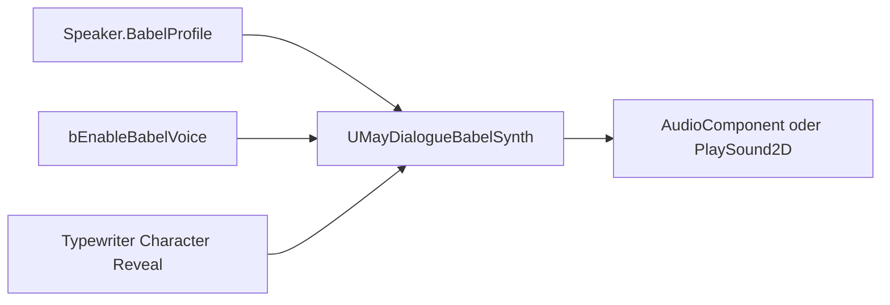

# Babel-System

**Babel** ist eine prozedurale Nonsense-Stimmen-Engine. Sie erzeugt aus Text akustisches Begleit-Material – nützlich als **Platzhalter** in der Entwicklung oder als **dauerhafter Stil** (Fears-to-Fathom-like, Animal-Crossing-like, Chattering-Monster).

## Wann greift Babel?

Globaler Schalter in den [Project Settings](../getting-started/project-settings.md):

* `bEnableBabelVoice = true` (Default).

Auf einer SayLine greift Babel, wenn:

1. Kein Voice-Asset für die aktuelle Culture existiert.
2. Oder Voice-Asset wurde bewusst leer gelassen.

## Architektur



## Komponenten

### `UMayDialogueBabelProfile`

Ein `UPrimaryDataAsset` mit den **Parameter-Sätzen** (siehe [Babel-Profile](babel-profiles.md)).

### `UMayDialogueBabelSynth`

Ein `UObject` (kein Component) mit Methoden:

```cpp
void Initialize(UMayDialogueBabelProfile* Profile, UWorld* World);
void OnCharacterRevealed(TCHAR Character, int32 CharIndex, int32 TotalChars);
void StartContinuousSpeech(const FString& FullText, float CharsPerSecond);
void Tick(float DeltaTime);
void Stop();
```

## Zwei Synthese-Modi

| Modus | Wie | Wofür |
| --- | --- | --- |
| **BlipPerCharacter** | Pro enthülltem Zeichen wird eine Sound-Probe gespielt. | Fears-to-Fathom-Style, VN-Blips, Animal-Crossing-Chatter. |
| **PhonemeBase** | Generiert sinusoidale Tones basierend auf Zeichen-Typ (Vokal/Konsonant). | Abstrakte, nicht-wörtliche „Stimme" für unheimliche Kreaturen. |

## Zwei Sync-Modi

| Modus | Wie |
| --- | --- |
| **TypewriterSync** | Reagiert auf Typewriter-`OnCharacterRevealed`-Events. |
| **Continuous** | Startet einen internen Timer und spielt unabhängig vom Typewriter. |

Der übliche Case ist **TypewriterSync + BlipPerCharacter** – klassisches *„bleep bleep bleep"* pro Zeichen.

## Babel pro Sprecher

Jeder Speaker im Asset kann ein **eigenes `BabelProfile`** haben:

* Der Wächter klingt anders als der Geist.
* Das Kind klingt anders als der Erwachsene.
* Der Monster-NPC hat keine Blips, sondern ein Phoneme-basiertes Groll-Muster.

## Integration im Widget

**Legacy-Pfad** (monolithisches Widget): `BabelSynth::OnCharacterRevealed` wird automatisch aus `UMayDialogueWidget::GetTypewriterText` gerufen.

**Component-Pfad** (UMG-Komponenten): Du musst im Blueprint `TextWidget->OnCharacterRevealed` an `BabelSynth->OnCharacterRevealed` binden. Aktuelles Gap – siehe [UI-Architektur](../ui/umg-architecture.md#typische-fehler).

Im **Preview-Runner** wird Babel automatisch 2D gespielt.

## Qualitäts-Anspruch

Babel ist **nicht nur ein Platzhalter**. Das Ziel ist: so gut klingen, dass man es im Final-Game behalten will, wenn man will. Pro-Speaker-Varianz, konfigurierbare Samples, Vokal-Pitch-Shift, Punctuation-Pausen – alles da.

## Limitationen

* **Procedural Blip-Caching fehlt** – pro Zeichen wird eine neue `USoundWaveProcedural` allokiert (akzeptabel für Fallback, aber Produktion sollte `BlipSounds` setzen).
* **Continuous Mode im Component-Pfad** feuert `Tick` nicht automatisch – Designer muss das in BP tun.
* **Babel-Qualität ist Work-in-Progress** (Backlog-Item 16). Funktional, aber noch nicht final-polish.

Weiter: [Babel-Profile](babel-profiles.md).
