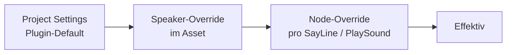

# Drei-Ebenen-Fallback

Audio-Einstellungen werden auf **drei Ebenen** gesetzt. Die spezifischere Ebene gewinnt.

## Die drei Ebenen



### 1. Projekt-Settings (Plugin-Default)

Einmal pro Projekt gesetzt. Standard-Werte für alles, das nicht übersteuert wird.

Properties (siehe [Projekt-Einstellungen](../getting-started/project-settings.md)):

* `DefaultSoundClass`
* `DefaultAttenuation`
* `bForce2D`
* `bEnableBabelVoice`
* `DefaultBabelProfile`

### 2. Speaker (im Dialog-Asset)

Pro Sprecher im [Speakers-Panel](../editor/speakers-panel.md). Gilt für alle SayLines dieses Sprechers, sofern der Node keine Node-Overrides setzt.

Speaker-Properties:

* `AudioModeOverride` (Default / Spatial3D / Force2D)
* `SoundClassOverride`
* `AttenuationOverride`
* `VolumeMultiplier`
* `PitchMultiplier`
* `BabelProfile`

### 3. Node (pro SayLine / PlaySound)

Feinste Kontrolle. Node-Overrides übersteuern Speaker- und Plugin-Defaults.

Node-Properties:

* `NodeAudioMode` (Default / Spatial3D / Force2D) – auf SayLine.
* `VolumeMultiplier` / `PitchMultiplier` – auf PlaySound (**auf SayLine nicht verfügbar, siehe Backlog**).

## Auflösungs-Algorithmus

Für eine SayLine:

1. Start mit Plugin-Defaults.
2. Wenn der Speaker einen Override definiert → überschreibt die entsprechenden Felder.
3. Wenn der Node einen Override definiert → überschreibt weiter.
4. Der resultierende Config wird an den `UAudioComponent` gehängt.

### Beispiel

```
Plugin-Default:
  SoundClass  = SC_Voice
  Attenuation = Att_Default
  bForce2D    = false

Speaker "Ghost":
  SoundClassOverride  = SC_VoiceGhost
  AttenuationOverride = Att_Whisper
  PitchMultiplier     = 0.8

Node SayLine (Ghost):
  NodeAudioMode = Force2D (innerer Monolog)
```

**Effektiv**:

* SoundClass = SC_VoiceGhost (vom Speaker übersteuert).
* Attenuation = Att_Whisper (vom Speaker).
* 2D-Modus = Force2D (vom Node).
* Pitch = 0.8 (vom Speaker).

## On-Demand-AudioComponent

Am **ersten** SayLine eines Sprechers wird per `UMayDialogueParticipant::GetOrCreateDialogueAudioComponent()` ein AudioComponent erstellt und am Actor befestigt. Es bleibt über die Dialog-Dauer bestehen und wird beim Dialog-Ende aufgeräumt.

Effekt: Kein Setup-Boilerplate, keine manuell angelegten Component-Slots am Actor.

## Force2D-Fall

Wenn `bForce2D` oder `NodeAudioMode = Force2D`:

* Es wird **kein** 3D-Component am Sprecher verwendet.
* Das Plugin spielt `UGameplayStatics::PlaySound2D` – der Sound kommt aus dem 2D-UI-Mixer-Kanal.

## Volume / Pitch

Volume- und Pitch-Multipliers **multiplizieren sich** über die Ebenen:

```
Effektiver_Volume = Plugin_Vol * Speaker_Vol * Node_Vol
Effektiver_Pitch  = Plugin_Pitch * Speaker_Pitch * Node_Pitch
```

## Wann welche Ebene?

| Ebene | Ideal für |
| --- | --- |
| Plugin | Projekt-globale Audio-Policy. |
| Speaker | Charakter-Eigenheiten (der Geist klingt immer so). |
| Node | Ausnahmen (diese eine Zeile ist innerer Monolog, also 2D). |

## Anmerkungen

* **VolumeMultiplier / PitchMultiplier auf SayLine** sind derzeit **nicht** verfügbar (Backlog-Item 11). Workaround: am Speaker setzen oder am PlaySound-Node.
* **bOverride2D auf SayLine** fehlt ebenfalls (Backlog-Item 10). Workaround: Speaker `AudioModeOverride = Force2D` setzen.
