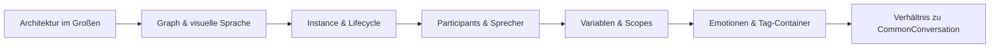

# Kern-Konzepte

Bevor du tief in einzelne Nodes tauchst, lohnt es sich, das mentale Modell zu festigen. Dieser Abschnitt erklärt, **wie MayDialogue denkt** – die Konzepte, die hinter jedem Feature stehen.

## Worum es geht

MayDialogue hat vier tragende Ideen. Wer sie einmal verstanden hat, findet sich im Rest der Doku (und im Code) ohne Reibung zurecht:

1. **Der Graph ist das Dokument.** Nicht der Details-Panel. Ein Dialog-Asset liest sich wie ein Drehbuch, nicht wie eine Property-Liste.
2. **Instance ist das laufende Gespräch.** Das Asset ist nur die Blaupause; jedes gestartete Gespräch lebt als eigene `UMayDialogueInstance` und hat einen vorhersagbaren Lebenszyklus.
3. **Participants sind die Akteure.** Jeder Actor, der spricht oder zuhört, trägt eine `UMayDialogueParticipant`-Komponente. Sie ist die Identität im Gespräch.
4. **Sub-Nodes komponieren Logik kompakt.** Requirements, Choices und SideEffects sind keine eigenen Graph-Boxen, sondern Pills im Body eines Eltern-Nodes.

## Reihenfolge der Kapitel

Die Reihenfolge ist nicht zwingend. Ein Designer, der hauptsächlich Dialoge schreibt, braucht **Graph**, **Participants** und **Variablen** am meisten. Ein Gameplay-Programmer, der die Runtime integriert, braucht **Architektur**, **Instance & Lifecycle** und **Common Conversation**.

## Wenn du in Eile bist

Die beiden wichtigsten Seiten sind:


[architecture.md](architecture.md)



[instance-lifecycle.md](instance-lifecycle.md)


Wer diese beiden Seiten durchhat, versteht das System im Groben.
