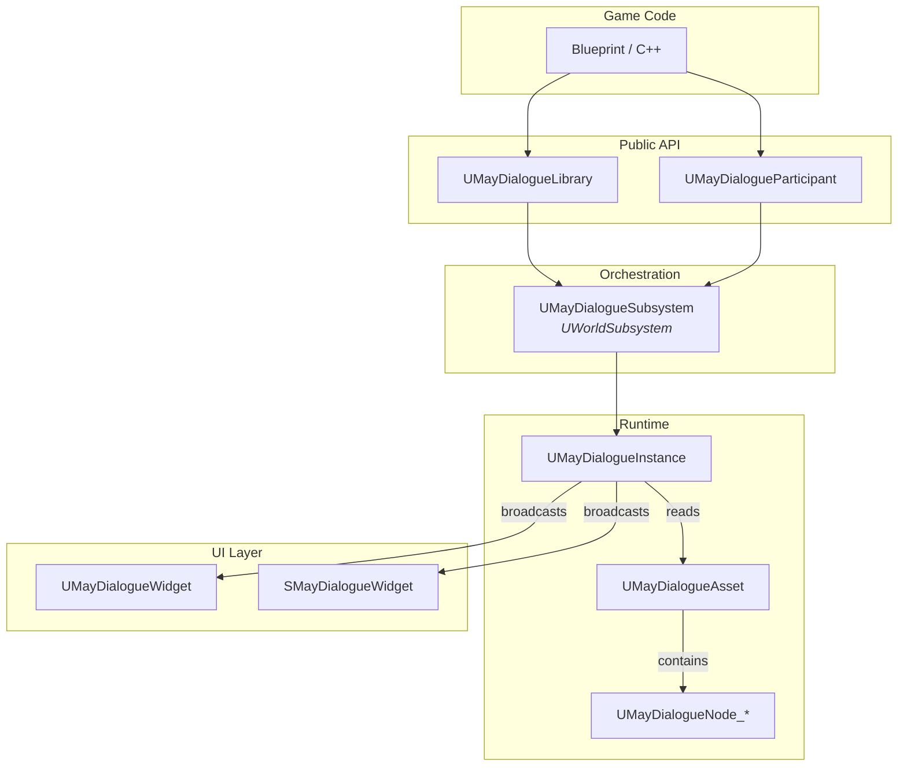
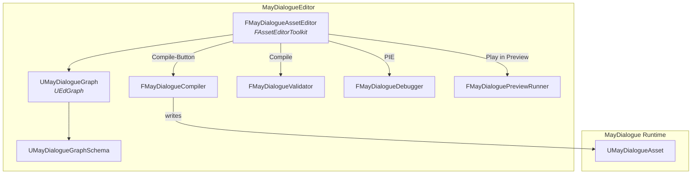
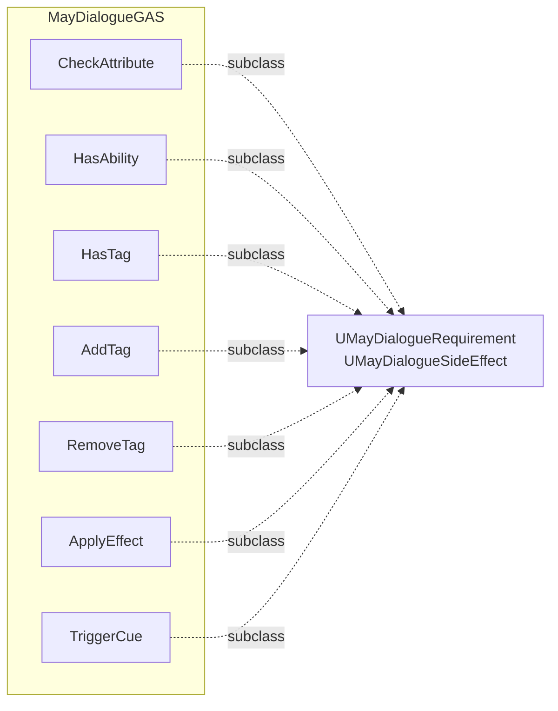

# Architektur im Großen

MayDialogue besteht aus **drei Modulen**, die auf drei unterschiedlichen Engine-Layern arbeiten. Dieses Kapitel zeigt dir, welches Modul wofür zuständig ist und wie sie miteinander reden.

## Die drei Module

| Modul | Typ | Lade-Phase | Wofür |
| --- | --- | --- | --- |
| `MayDialogue` | `Runtime` | `PreDefault` | Kern: Asset, Instance, Subsystem, Nodes, UI, Audio, Participant |
| `MayDialogueEditor` | `UncookedOnly` | `PreDefault` | Asset-Editor, Graph, Compiler, Validator, Debugger, Preview |
| `MayDialogueGAS` | `Runtime` | `Default` | GAS-spezifische Requirements & SideEffects |

### Warum drei Module?

* **Editor-Code darf nicht in den Shipping-Build.** `UncookedOnly` für `MayDialogueEditor` garantiert das.
* **GAS als erste-Klasse-Bürger, aber ohne Core-Abhängigkeit im Public-Header.** Das Core-Modul `MayDialogue` referenziert `GameplayAbilities` nur privat; das öffentliche API-Surface bleibt GAS-frei. Projekte, die GAS nicht nutzen wollen, können das GAS-Modul (theoretisch) deaktivieren, ohne die Runtime zu zerbrechen.
* **Lade-Reihenfolge.** `MayDialogue` lädt in `PreDefault`, `MayDialogueGAS` in `Default` – damit sind Base-Klassen garantiert verfügbar, wenn GAS seine Subklassen registriert.

## Die Laufzeit-Schichten

### UMayDialogueSubsystem

Ein **WorldSubsystem**, d.h. eins pro Welt. Es ist die **einzige Autorität**, die neue Dialog-Instanzen erzeugen darf.

* `StartDialogue(Asset, Instigator, Target)` — erzeugt und startet eine neue Instance.
* `StopDialogue(Instance)` / `StopAllDialogues()` — bricht ab.
* `GetActiveDialogue()` / `IsAnyDialogueActive()` — Abfrage.
* `OnAnyDialogueStarted` / `OnAnyDialogueEnded` — Delegates für Lifecycle.

Tick-Methode: räumt beendete Instanzen am Frame-Ende auf (`CleanupCompletedDialogues`).

### UMayDialogueInstance

Ein reines `UObject` (kein Actor, keine Komponente). Hält den **Zustand eines laufenden Gesprächs**:

* Aktueller Node, aktuelle Message, aktuelle Choices.
* Dialogue-Scope-Variablen (`FInstancedPropertyBag`).
* Scope-Stack für Link-/SubGraph-Rücksprünge.
* Async-Node-Registry (wer wartet gerade auf was).
* Camera-Blend-State.

Der [Lifecycle](instance-lifecycle.md) wird im nächsten Kapitel ausführlich.

### UMayDialogueAsset

Ein **`UPrimaryDataAsset`**. Enthält:

* Die kompilierte Node-Map (`TMap<FGuid, UMayDialogueNode_Base*>`).
* Die Entry-Point-GUID.
* Die Sprecher-Liste (`TArray<FMayDialogueSpeaker>`).
* Editor-only: die Source-UEdGraphs (werden nicht gepackt).

Der **Compiler** im Editor-Modul schreibt die Node-Map aus den UEdGraph-Nodes. Zur Laufzeit existieren die UEdGraphs nicht mehr – nur die kompilierten Runtime-Nodes.

## Der Editor-Layer

### Asset-Editor

`FMayDialogueAssetEditor` ist ein `FAssetEditorToolkit` mit **zehn Tab-IDs**:

`GraphTab`, `DetailsTab`, `CompilerResultsTab`, `FindResultsTab`, `PaletteTab`, `VariablesTab`, `SpeakersTab`, `DebuggerWatchTab`, `PreviewTab`, `OutlineTab`.

Details siehe [Editor → Asset-Editor](../editor/asset-editor.md).

### Compiler & Validator

Beide sind **statische Klassen** ohne Instanz. Der Compiler wird automatisch nach Graph-Änderungen getriggert (`bAutoCompileOnSave` in den Editor-Settings). Der Validator läuft vor jedem Compile und befüllt den Compiler-Results-Tab.

### Debugger & Preview

Zwei getrennte Werkzeuge mit unterschiedlichem Einsatzzweck:

* **Debugger** lebt in **PIE** – richtige Spielwelt, echte Participants, echte GAS-States. Mit Breakpoints und Step-Controls.
* **Preview** lebt **im Asset-Editor selbst** – keine PIE-Ladung, simulierter GAS-State, perfekt für schnelle Text-Iteration.

## Das GAS-Modul

Das GAS-Modul **erweitert** das Core-Modul, ohne es zu modifizieren. Dank UE-Reflection erscheinen die GAS-Subklassen automatisch im Sub-Node-Picker, sobald das Modul geladen ist. Das Core-Modul weiß nichts davon.

Details siehe [GAS-Integration](../gas/README.md).

## Daten-Fluss auf einen Blick

Ein SayLine wird gespielt:

1. `Instance::ContinueToNode(NodeGuid)` ruft `Node->ExecuteNode(Context)`.
2. Der Node baut eine `FMayDialogueMessage` und ruft `Instance::ReceiveMessage(Message, NextNodeGuid)`.
3. `Instance` broadcastet `OnMessageReceived`.
4. Das abonnierte Widget (UMG oder Slate) rendert Text + startet Typewriter.
5. Bei Advance-Input ruft das Widget `Instance::AdvanceDialogue()`.
6. Instance holt den nächsten Node und beginnt von vorne.

Alle Events sind **Multicast-Delegates**, d.h. beliebig viele Listener können gleichzeitig lauschen – das Widget, dein Quest-System, ein Analytics-Logger, ein Achievements-Tracker.

## Zusammenfassung

| Schicht | Lebenszeit | Zuständig für |
| --- | --- | --- |
| Asset | Package/Disk | Struktur: Nodes, Speakers, Variablen-Deklarationen |
| Subsystem | Welt | Orchestrierung, aktive Instanzen |
| Instance | Dialog-Dauer | Graph-Traversierung, Scope, Delegates |
| Node | Dialog-Dauer | Einzelne Aktion / Entscheidung |
| Participant | Actor-Lebenszeit | Sprecher-Identität, Persistent-Memory |
| Widget | Dialog-Dauer | Präsentation |
| Editor-Toolkit | Editor-Session | Autoring, Debug, Preview |

Nächster Stopp: **wie der Graph visuell aufgebaut ist** – [Graph & visuelle Sprache](graph-visual-language.md).
