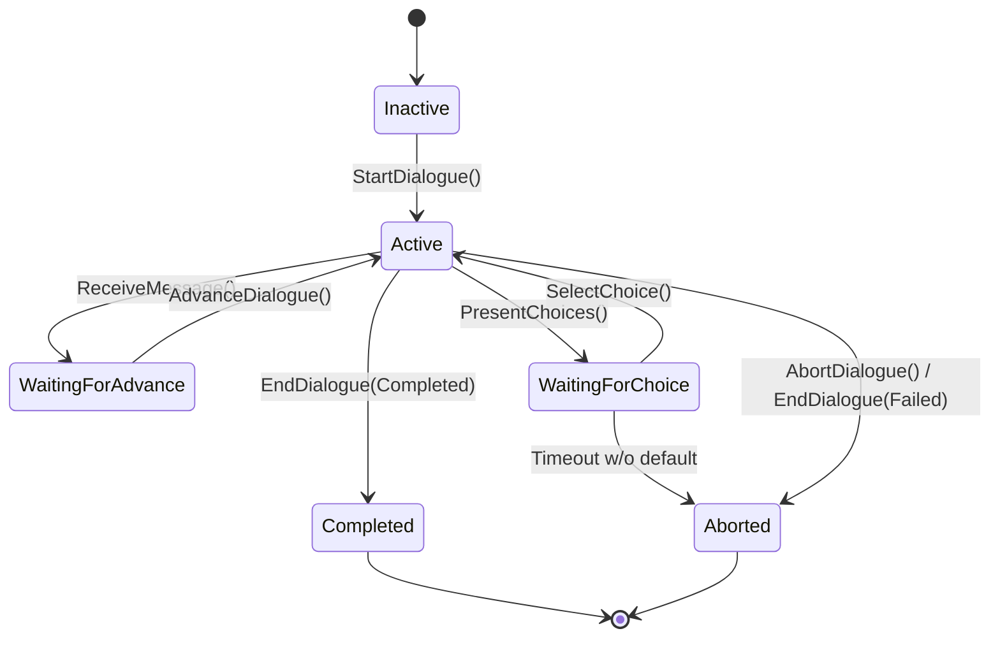

# Instance & Lifecycle

Ein `UMayDialogueAsset` ist nur eine Blaupause. Das **laufende Gespräch** ist eine `UMayDialogueInstance`. Dieses Kapitel zeigt dir, welche Zustände eine Instance durchläuft, wie sie Nodes traversiert und wie sie sauber aufräumt.

## Die Zustands-Maschine



Enum: `EMayDialogueStatus { Inactive, Active, WaitingForAdvance, WaitingForChoice, Completed, Aborted }`.

## Startphase

`UMayDialogueSubsystem::StartDialogue(Asset, Instigator, Target)` macht fünf Dinge:

1. **Pre-Flight**: Hat das Asset einen Entry? Ist kein anderer Dialog aktiv (oder wird er zuerst abgebrochen)?
2. **Instance erzeugen**: `NewObject<UMayDialogueInstance>(...)`.
3. **Participants auflösen**: Die im Asset referenzierten Sprecher-Tags werden gegen die in der Welt lebenden `UMayDialogueParticipant`-Komponenten gematcht.
4. **OnDialogueStarted broadcasten** – sowohl am Subsystem als auch an der Instance.
5. **Entry-Node ansteuern**: `ContinueToNode(Asset.EntryPointGuid)`.

## Node-Ausführung

Jeder Node überschreibt `ExecuteNode(Context) → FMayDialogueTaskResult`. Das TaskResult ist der **Flow-Control-Kern**:

```cpp
struct FMayDialogueTaskResult
{
    EMayDialogueTaskResultType Type;
    FGuid NextNodeGuid;

    static FMayDialogueTaskResult Advance(FGuid Next);
    static FMayDialogueTaskResult Abort();
    static FMayDialogueTaskResult PauseAndPresentChoices();
    static FMayDialogueTaskResult ReturnToStart();
    static FMayDialogueTaskResult ReturnToLast();
    static FMayDialogueTaskResult ReturnToCurrent();
};
```

### TaskResult-Typen

| Typ | Wirkung |
| --- | --- |
| `AdvanceDialogue` | Weiter zum angegebenen Next-Node. |
| `AdvanceDialogueWithChoice` | Semantischer Marker (nach Choice-Selektion). |
| `PauseDialogueAndPresentChoices` | Setzt `WaitingForChoice`, broadcastet `OnChoicesPresented`. |
| `ReturnToLastChoice` | Springt zurück zum letzten PlayerChoice. |
| `ReturnToCurrentChoice` | Wiederholt die aktuelle Choice-Präsentation. |
| `ReturnToDialogueStart` | Springt an den Entry zurück. |
| `AbortDialogue` | Beendet als `Aborted`. |

Die Instance interpretiert das Result und ruft die passende Methode (`AdvanceDialogue`, `PresentChoices`, `AbortDialogue` …).

## Requirements vor der Ausführung

Bevor ein Node ausgeführt wird, prüft die Instance dessen `Requirements` (falls vorhanden). Das Ergebnis ist `EMayDialogueRequirementResult`:

* **Passed** – Node wird normal ausgeführt.
* **FailedButVisible** / **FailedAndHidden** – Node wird *nicht* ausgeführt. Weiter geht's je nach `FailBehavior` (`Skip` oder `Abort`).


**Bekannte Einschränkung.** In der aktuellen Version wertet `ExecuteNode_Implementation` das Ergebnis der Requirement-Evaluation noch nicht konsequent aus. Das `FailBehavior`-Feld greift nicht vollständig; geplant für ein Folge-Update (Backlog-Item 5 in `BACKLOG.md`).


## Choices

Ein **PlayerChoice**-Node baut seine Choice-Liste in drei Schritten:

1. **Build**: Für jede Choice: Requirements evaluieren, `FMayDialogueChoiceEntry` erzeugen (mit Availability, Text, Tags, Target).
2. **Filter**: `FailedAndHidden`-Choices werden entfernt.
3. **Present**: `Instance::PresentChoices(Choices, Timeout, DefaultIndex)` setzt `Status = WaitingForChoice` und broadcastet `OnChoicesPresented`.

Das UI nimmt den Entry-Array und rendert Buttons. Der Spieler klickt → `Instance::SelectChoice(Index)`:

1. **Re-Evaluate**: Die Availability der gewählten Choice wird erneut geprüft (falls sich Variablen in der Wartezeit änderten).
2. **SideEffects**: `Choice.SideEffects` werden ausgeführt.
3. **Transition**: Zum `TargetNodeGuid` der Choice.

## Async-Nodes

Manche Nodes warten auf externe Events statt sofort zu resultieren:

* **Wait** mit Duration / EventTag.
* **PlayAnimation** mit `bWaitForMontageEnd`.
* **CameraFocus** mit Blend-Time (je nach Implementierung).

Pattern:

1. Node registriert sich via `Instance::RegisterActiveAsyncNode(Node)`.
2. Node merkt sich den `NextNodeGuid` und den Trigger (Timer, Montage-End-Delegate, Event-Listener).
3. Trigger feuert → Node ruft `Instance::ForceTransitionToNode(NextNodeGuid)`.

Beim Abort ruft die Instance `CleanupPendingAsyncNodes()`, damit keine Delegates mehr auf eine zerstörte Instance zielen.


Wenn ein async Node stecken bleibt (z.B. Event-Tag feuert nie, Montage endet nie), bleibt die Instance in `Active` hängen. Der [Validator](../editor/asset-editor.md#validator) warnt, wenn ein async Node keine klare Continuation hat.


## Links & Scope-Stack

**Link**- und **SubGraph**-Nodes pushen einen Frame auf den **Scope-Stack**:

```
ScopeStack: [
  { Asset: "A", ReturnNodeGuid: "SayLine_X" },
  { Asset: "B", ReturnNodeGuid: "LinkNode_Y" }
]
```

Beim Exit eines verlinkten Dialogs:

1. Wenn Stack **nicht leer**: Pop, weiter am `ReturnNodeGuid`.
2. Wenn Stack **leer**: Dialog endet als Completed.

So funktionieren beliebig tief geschachtelte Dialog-Fragmente (Common-Greeting, Common-Farewell).

## Immediate-Transitions & Safety

Wenn mehrere Nodes mit `AdvanceMode = Immediate` hintereinander stehen, werden sie in **einer** Instance-Tick-Iteration durchlaufen – kein neuer Frame dazwischen. Damit das nicht zu Endlosschleifen wird:

* Visited-Set pro Chain.
* (Geplant, Backlog) Max-Hops-Limit.

## End-Phase

### EndDialogue (Completed)

Erreicht durch einen Exit-Node mit `ExitStatus = Completed`:

1. `CleanupPendingAsyncNodes()` – alle Timer / Event-Listener trennen.
2. `ActiveVoiceComponent` stoppen.
3. Laufende Montagen unbinden.
4. Camera auf Ursprung zurück-blenden (wenn `CameraFocus` aktiv).
5. `OnDialogueEnded` broadcasten mit `ExitStatus = Completed`, Dauer, Instigator, Target.
6. Subsystem markiert die Instance zur Entfernung; `CleanupCompletedDialogues` beseitigt sie am Frame-Ende.

### AbortDialogue

Erreicht durch externen Aufruf (neuer Dialog startet, Level-Travel, Code-Abort):

* Gleicher Cleanup wie oben.
* `ExitStatus = Aborted`.

### EndDialogue (Failed)

Erreicht durch Exit-Node mit `ExitStatus = Failed` oder Requirement-Abort:

* Wie Completed, aber Status = Failed.

## Lebenszyklus-Delegates

Die wichtigsten Hooks, an die du dich anklemmen kannst:

| Delegate | Aufruf-Zeitpunkt | Parameter |
| --- | --- | --- |
| `OnDialogueStarted` | Beim Start | Asset, Instigator, Target, StartTime |
| `OnNodeReached` | Nach Node-Execution | NodeGuid, Node* |
| `OnMessageReceived` | Sobald SayLine-Message feststeht | `FMayDialogueMessage&` |
| `OnChoicesPresented` | Sobald Choices stehen | Array |
| `OnChoiceMade` | Nach `SelectChoice` | ChoiceIndex |
| `OnVariableChanged` | Variable-Mutation | Name, Scope, Typ, NewValue |
| `OnDialogueEventFired` | FireEvent-Node | EventTag |
| `OnDialogueEnded` | Beim Ende | Asset, ExitStatus, Duration, Instigator, Target |

Alle sind **Multicast** – mehrere Systeme können parallel lauschen.

## Was du merken solltest

* Eine Instance ist ein reines `UObject`, keine Actor-Komponente. Lebensdauer = Dialog-Dauer.
* TaskResults sind der Kern des Flow-Controls – jeder Node gibt deklarativ zurück, was passieren soll.
* Requirements entscheiden über Sichtbarkeit und Availability.
* Async-Nodes müssen sauber aufräumen – sonst Zombie-State.
* Scope-Stack macht Link/SubGraph robust.

Weiter mit den Akteuren: [Participants & Sprecher](participants-speakers.md).
