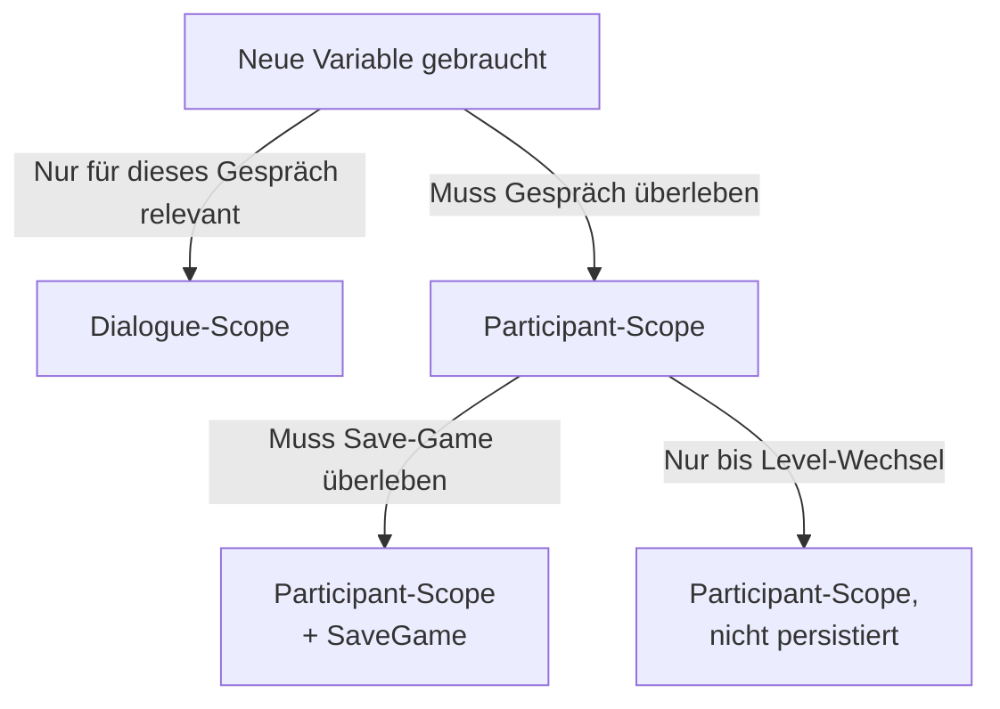

# Variablen & Scopes

MayDialogue hat ein **zwei-Scope-Modell** für Variablen. Dieses Kapitel erklärt beide, zeigt wann du welchen nutzt, und wie du sie aus Dialog, Blueprint oder C++ ansprichst.

## Die zwei Scopes

| Scope | Lebensdauer | Storage | Typische Nutzung |
| --- | --- | --- | --- |
| **Dialogue** | Nur während des laufenden Gesprächs | `UMayDialogueInstance.DialogueVariables` (`FInstancedPropertyBag`) | Counter innerhalb einer Szene, Zwischenzustände, Aggregationen |
| **Participant** | Überdauert Gespräche & (optional) Saves | `UMayDialogueParticipant.PersistentMemory` (`FInstancedPropertyBag`, SaveGame) | „Hat mich schon mal getroffen", Beziehungswerte, Weltkenntnisse |

## Unterstützte Typen

Enum `EMayDialogueVariableType`:

* `Bool`
* `Int`
* `Float`
* `String`
* `Tag` (`FGameplayTag`)

Diese fünf Typen decken die allermeisten Dialog-Variablen-Fälle ab. Wer komplexere Daten braucht, nutzt ein Projekt-eigenes Subsystem oder hängt Properties direkt an die Participant-Komponente.

## Deklaration

Variablen werden im **Variables-Panel** des Asset-Editors angelegt:

| Spalte | Bedeutung |
| --- | --- |
| `Name` | Eindeutiger Name innerhalb des Scopes (FName). |
| `Typ` | Einer der fünf Typen. |
| `Scope` | Dialogue oder Participant. |
| `Default` | Initialwert. |

## Setzen & Lesen im Dialog-Graph

### Setzen

**`SetVariable`** existiert in zwei Formen:

* Als **Action-Node** (eigene Box im Flow).
* Als **SideEffect-Sub-Node** an einem bestehenden Node.

Beide zeigen dieselben Properties: Variable-Name, Typ, Scope, Value. Für Participant-Scope: zusätzlich der `TargetParticipantTag` (wer bekommt die Variable gesetzt).

### Lesen

Lesen passiert über **Requirements** (auf Choice / Branch):

* **CheckDialogueVariable** (Beispiel aus Projekt-Logik, aus dem Plugin ableitbar).
* **CheckParticipantVariable**.

Oder – wenn du kein generisches Requirement hast – über eigene Blueprint-Requirements, die das Variable-Query intern machen.

## Setzen & Lesen aus Code

### Dialogue-Scope

```cpp
UMayDialogueInstance* Instance = Subsystem->GetActiveDialogue();
if (!Instance) return;

// Setzen
Instance->SetDialogueVariableBool("HasAngered", true);
Instance->SetDialogueVariableInt("Provocations", 3);

// Lesen
bool Angered = Instance->GetDialogueVariableBool("HasAngered");
int32 Count = Instance->GetDialogueVariableInt("Provocations");
```

### Participant-Scope

```cpp
UMayDialogueParticipant* Part = Actor->FindComponentByClass<UMayDialogueParticipant>();
if (!Part) return;

// Setzen
Part->SetPersistentBool("HasMet", true);
Part->SetPersistentFloat("Friendship", 12.5f);
Part->SetPersistentTag("LastMood", FGameplayTag::RequestGameplayTag("Mood.Friendly"));

// Lesen mit Default
bool HasMet = Part->GetPersistentBool("HasMet", false);
float Friendship = Part->GetPersistentFloat("Friendship", 0.0f);
```

### Generische Namespace-API

`MayDialogue::Variables::Get(...)` und `...::Set(...)` lesen/schreiben als String – praktisch für Bridge-Tools (Cheat-Menüs, Debug-UIs):

```cpp
FString ValueAsString;
bool bSuccess = MayDialogue::Variables::Get(
    Instance, Participant,
    EMayDialogueVariableScope::Participant,
    "HasMet",
    EMayDialogueVariableType::Bool,
    ValueAsString
);
```

## OnVariableChanged

Jede Variablen-Mutation (in beiden Scopes) broadcastet `OnVariableChanged`:

```cpp
Instance->OnVariableChanged.AddDynamic(this, &AQuestDirector::HandleDialogVarChanged);

void AQuestDirector::HandleDialogVarChanged(
    FName VarName,
    EMayDialogueVariableScope Scope,
    EMayDialogueVariableType Type,
    FString NewValueAsString)
{
    if (VarName == "QuestAccepted" && NewValueAsString == "true")
    {
        // Quest starten
    }
}
```

## Wann welcher Scope?



Beispiele:

| Variable | Scope | Warum |
| --- | --- | --- |
| „Hat der Spieler schon nach dem Namen gefragt" | Dialogue | Nur diese Session relevant |
| „Wie oft wurde provoziert" | Dialogue | Counter innerhalb der Szene |
| „Spieler kennt das Geheimnis" | Participant + Save | Gilt für alle folgenden Gespräche mit dieser Figur |
| „Friendship-Level" | Participant + Save | Persistente Beziehung |
| „Hat in diesem Level schon gesprochen" | Participant, nicht persistiert | Session-scoped, aber gesprächsübergreifend |

## Einschränkungen

* **Keine Rechenoperationen.** `SetVariable` setzt Werte, nicht Ausdrücke. „Friendship += 5" ist aktuell nicht im Graph machbar; entweder du berechnest es in einem Blueprint-SideEffect oder nutzt ein eigenes Requirement/SideEffect-Pair.
* **Kein Tag-Branch in SetVariable.** Aktuell kein UI-Code-Pfad für `Tag`-Werte im SetVariable-Node (Backlog-Item 9 in `BACKLOG.md`).
* **Variables::Copy ist nicht implementiert.** Bulk-Kopie zwischen Scopes / Participants steht auf der Roadmap.
* **SetVariable schreibt derzeit nur in Instance-Scope, nicht in Participant-PersistentMemory.** (Backlog-Item 8). Bis dahin: für Participant-Schreiben ein Blueprint-SideEffect benutzen, der `SetPersistentXxx` auf der Komponente aufruft.

## Zusammengefasst

* **Dialogue-Scope** für alles, was nur innerhalb eines Gesprächs lebt.
* **Participant-Scope** für alles, was den Actor überdauern soll.
* Fünf Typen: Bool, Int, Float, String, Tag.
* `OnVariableChanged` als Hook für externe Systeme.
* Ein paar Features (Participant-Schreiben aus SetVariable-Node, Tag-Branch, Bulk-Copy) sind Work-in-Progress.

Weiter: [Emotionen & Tag-Container](emotions-tags.md).
