---
description: Dialog-Asset anlegen, NPC ins Level, testen: in fünf Minuten.
---

# Quick Start

Am Ende dieser Anleitung steht ein spielbarer NPC-Dialog im Level: Ein Wächter stellt eine Frage, der Spieler wählt aus zwei Antworten, jede führt zu einer anderen Reaktion. Kein UMG-Setup, kein Audio-Handling, kein Input-Gefrickel: das Plugin erledigt das alles.

Voraussetzung: Plugin installiert (siehe [Installation](installation.md)).

---

## Schritt 1: Dialog-Asset anlegen

1. Content Browser öffnen.
2. Rechtsklick in `Content/Dialogues/` (Ordner ggf. anlegen).
3. **May Dialogue → Dialogue Asset** wählen.
4. Asset benennen: `DA_Greeting_Simple`.
5. Doppelklick öffnet den Graph-Editor.

Du siehst einen leeren Graph mit einem **Entry-Node** (grüne Kapsel). Der Entry-Node ist immer vorhanden und immer der Startpunkt des Dialogs.

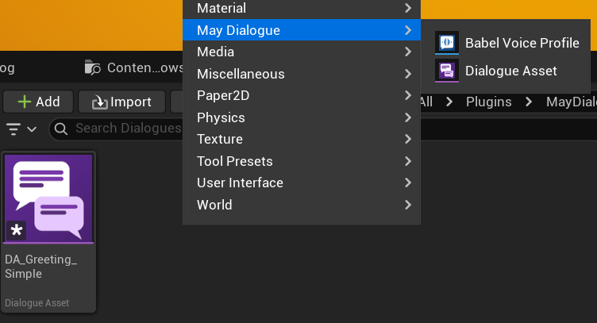

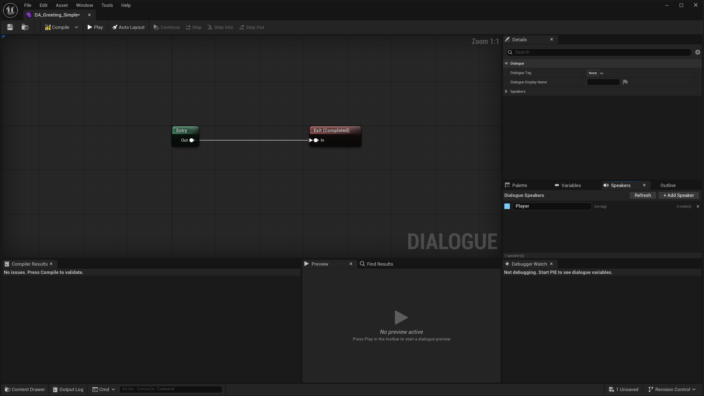

---

## Schritt 2: Sprecher definieren

Im **Speakers-Panel** (Seitenleiste des Asset-Editors):

**Wächter (Sprecher 1):**
1. **Add Speaker** klicken.
2. Tag: `Dialogue.Speaker.Guard`.
3. DisplayName: `Wächter`.
4. NodeColor: Dunkelrot.

**Spieler (Sprecher 2):**
1. **Add Speaker** klicken.
2. Tag: `Dialogue.Speaker.Player`.
3. DisplayName: `Du`.
4. NodeColor: Grau.

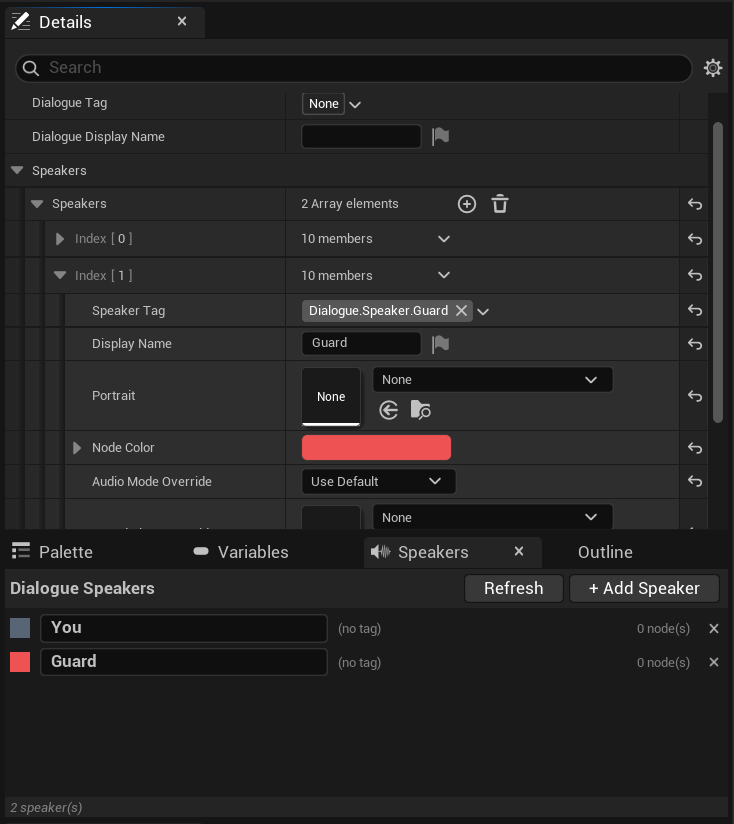

---

## Schritt 3: Erste SayLine

1. Rechtsklick im Graph → **Say Line** wählen.
2. Den neuen Node im Details-Panel (oder per Doppelklick im Node) konfigurieren:
   * `SpeakerTag`: `Dialogue.Speaker.Guard`
   * `DialogueText`: `Halt! Wer bist du?`
3. Entry-Output-Pin mit dem Input-Pin der SayLine verbinden.

Die Title-Bar des Nodes nimmt automatisch die Farbe des gewählten Sprechers an (dunkelrot).

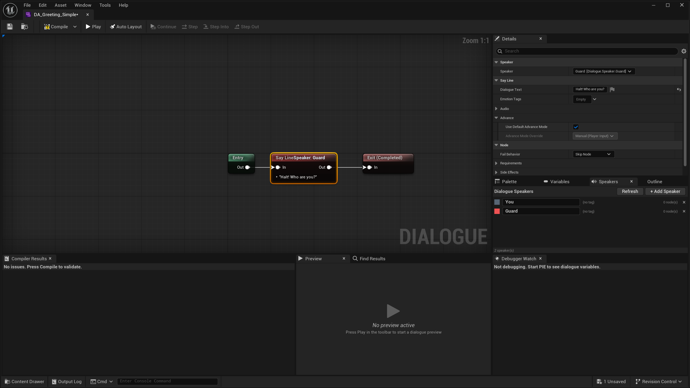

---

## Schritt 4: PlayerChoice anlegen

1. Rechtsklick im Graph → **Player Choice** wählen.
2. SayLine-Output-Pin mit PlayerChoice-Input-Pin verbinden.
3. Im Details-Panel: `PromptText` = `Du antwortest:` (optional).
4. Im Choices-Array zwei Elemente hinzufügen:
   * Choice 0: Text `Ein Freund des Königs.`
   * Choice 1: Text `Das geht dich nichts an.`

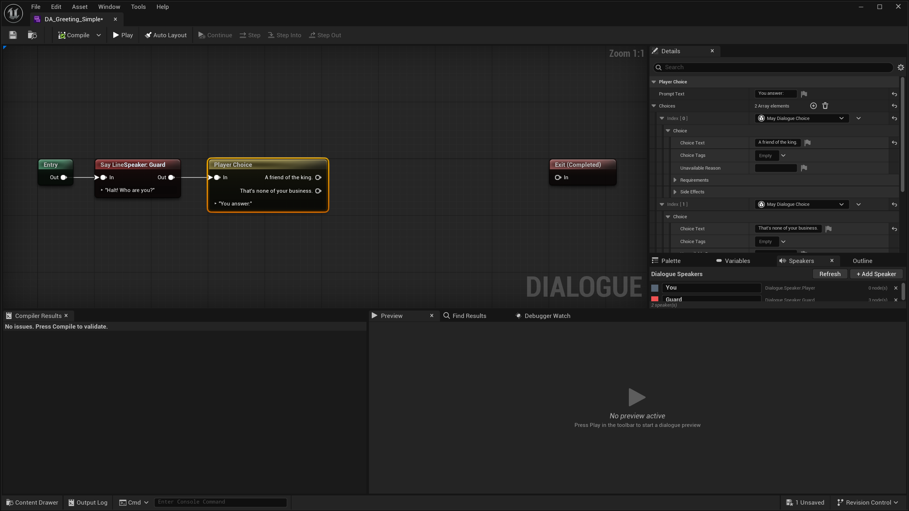

---

## Schritt 5: Reaktions-SayLines

Für jede Choice eine eigene SayLine als Reaktion:

**SayLine A:**
* `SpeakerTag`: `Dialogue.Speaker.Guard`
* `DialogueText`: `Dann passiere in Frieden.`

**SayLine B:**
* `SpeakerTag`: `Dialogue.Speaker.Guard`
* `DialogueText`: `Dann verzieh dich!`

Verbinden:
* Output-Pin 0 des PlayerChoice → SayLine A Input-Pin.
* Output-Pin 1 des PlayerChoice → SayLine B Input-Pin.

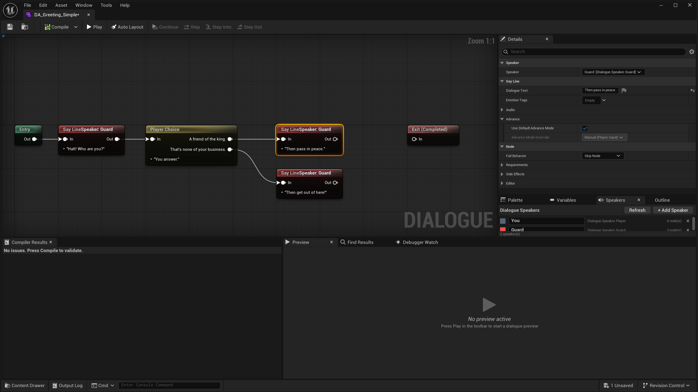

---

## Schritt 6: Exit

1. Rechtsklick im Graph → **Exit** wählen.
2. SayLine A Output-Pin → Exit Input-Pin verbinden.
3. SayLine B Output-Pin → Exit Input-Pin verbinden (gleicher Exit-Node).

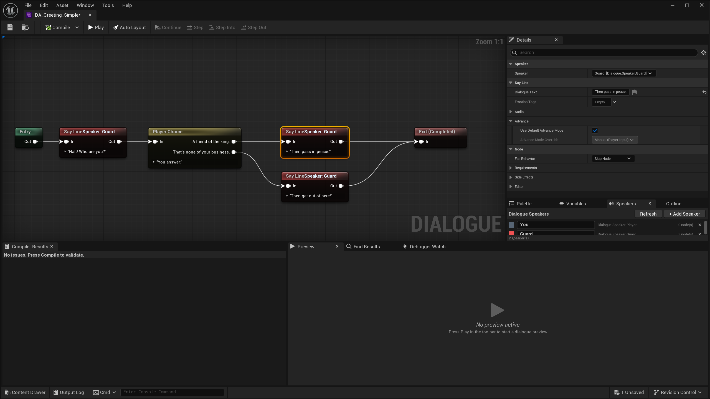

---

## Schritt 7: Compile

**Toolbar → Compile** klicken.

Falls der Validator Fehler meldet, behebe sie im **Compiler Results**-Panel:

| Fehler | Ursache | Lösung |
| --- | --- | --- |
| Unverbundener Output-Pin | Ein Node hat keinen Ausgang | Output-Pin an Exit oder nächsten Node hängen |
| Sprecher-Tag leer | SayLine ohne Speaker | Im Details-Panel SpeakerTag setzen |
| Leere SayLine | Kein Text | Text eintragen |

---

## Optional: Schnelltest im Editor: Preview Runner

Bevor du einen einzigen Level-Actor platzierst, kannst du den gesamten Dialog-Ablauf direkt im Asset-Editor durchspielen: ohne PIE.

Suche im Asset-Editor das **Preview**-Panel (standardmäßig unterhalb des Graphen angedockt). Klicke auf **Play**, um zu starten:

* Das Preview markiert den aktuell aktiven Node im Graphen in Echtzeit.
* Sprecher-Name und Dialogtext erscheinen im Preview-Panel.
* Sobald ein PlayerChoice-Node erreicht wird, erscheinen anklickbare Choice-Buttons: Klick auf eine Choice setzt den Ablauf fort.
* Klicke **Stop** (oder lass den Dialog den Exit-Node erreichen), um die Session zu beenden.

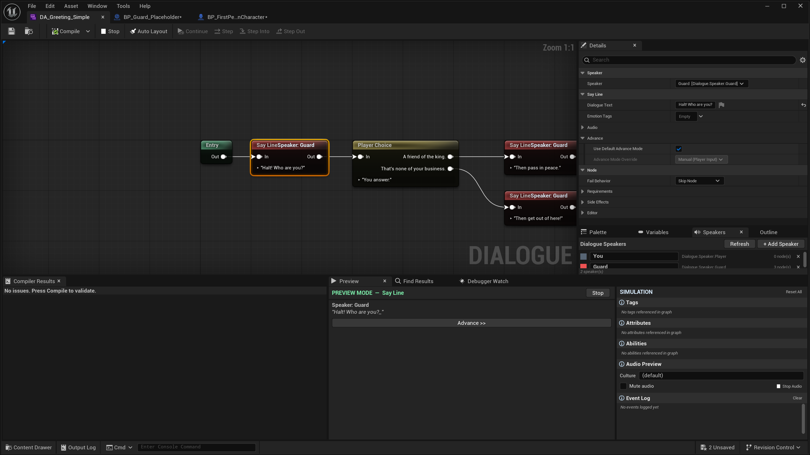

Das ist der schnellste Weg, um Ablauf und Text zu prüfen, bevor du das Level anfasst. Requirements und Side Effects, die von GAS oder persistenten Variablen abhängen, werden im Preview übersprungen: die Verzweigungsstruktur ist aber vollständig testbar.

---

## Schritt 8: NPC und Spieler-Pawn mit Participant-Komponente versehen

**Wächter-Actor:**

1. Level öffnen.
2. Beliebigen Actor als Wächter-Platzhalter ins Level setzen (z.B. einen Character Blueprint oder einen StaticMesh-Actor).
3. Actor in der Details-Panel: **Add Component → MayDialogue Participant**.
4. Komponente konfigurieren:
   * `ParticipantTag`: `Dialogue.Speaker.Guard`
   * `DisplayName`: `Wächter`
   * `DefaultDialogue`: `DA_Greeting_Simple`

**Spieler-Pawn:**

1. Öffne dein Spieler-Pawn-Blueprint (z.B. `BP_ThirdPersonCharacter`) im Blueprint-Editor.
2. Im **Components**-Panel oben links: **Add Component → MayDialogue Participant**.
3. Komponente konfigurieren:
   * `ParticipantTag`: `Dialogue.Speaker.Player`

Das Plugin benötigt diese Komponente, um zu wissen, wer der Instigator des Dialogs ist: auch wenn der Spieler selbst im Quick Start keine eigenen SayLines hat.

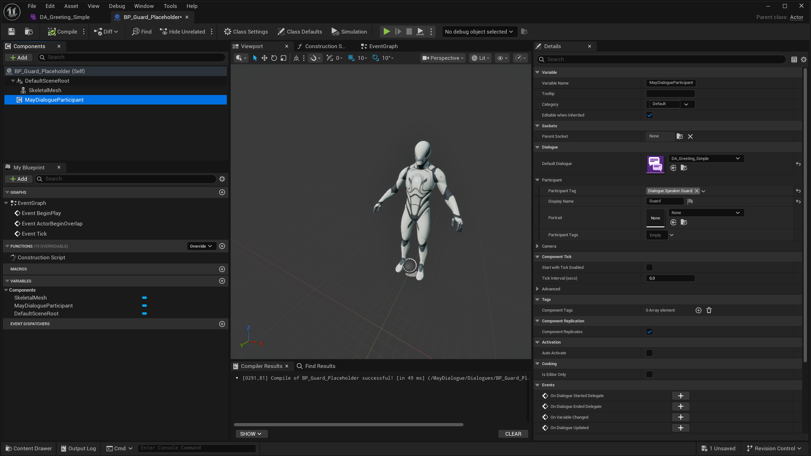

---

## Schritt 9: Dialog auslösen


**Empfohlener Weg für Blueprint-Nutzer: Variante A**


**Variante A: direkt über den Participant (empfohlen):**

Im Blueprint-Graph deines Trigger-Actors oder deiner Spieler-Logik:

1. Referenz zum Wächter-Actor holen.
2. **Get Component by Class: MayDialogueParticipant** aufrufen.
3. Auf dem Participant: **Start Default Dialogue** aufrufen.
4. `Other`-Parameter: Referenz zur Spieler-Participant-Komponente.

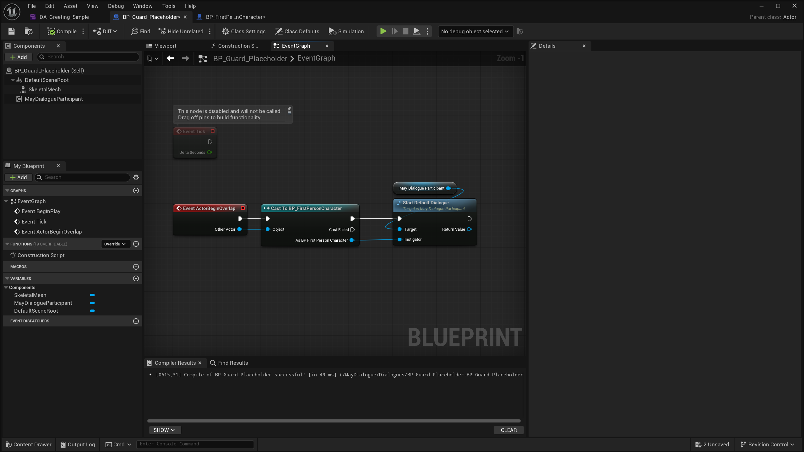

**Variante B: über die Library-Funktion:**

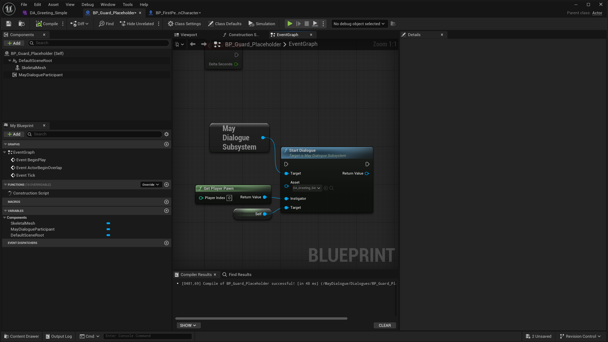

```
MayDialogueLibrary → StartDialogue
  WorldContext = Self
  Asset        = DA_Greeting_Simple
  Instigator   = PlayerPawn
  Target       = GuardActor
```

<details>
<summary>Für C++-Nutzer</summary>

```cpp
UMayDialogueParticipant* GuardParticipant =
    Guard->FindComponentByClass<UMayDialogueParticipant>();
if (GuardParticipant)
{
    GuardParticipant->StartDefaultDialogue(Player);
}
```

</details>

---

## Schritt 10: Testen

**PIE starten**, zum Wächter gehen und den Trigger auslösen.

Was du siehst:
* Ein Widget erscheint im Viewport (Slate-Debug-Widget, solange noch kein UMG-Widget gesetzt ist).
* Der Wächter spricht: *"Halt! Wer bist du?"*.
* Zwei Choice-Buttons erscheinen.
* Klick auf eine Choice führt zur passenden Reaktion und der Dialog endet.

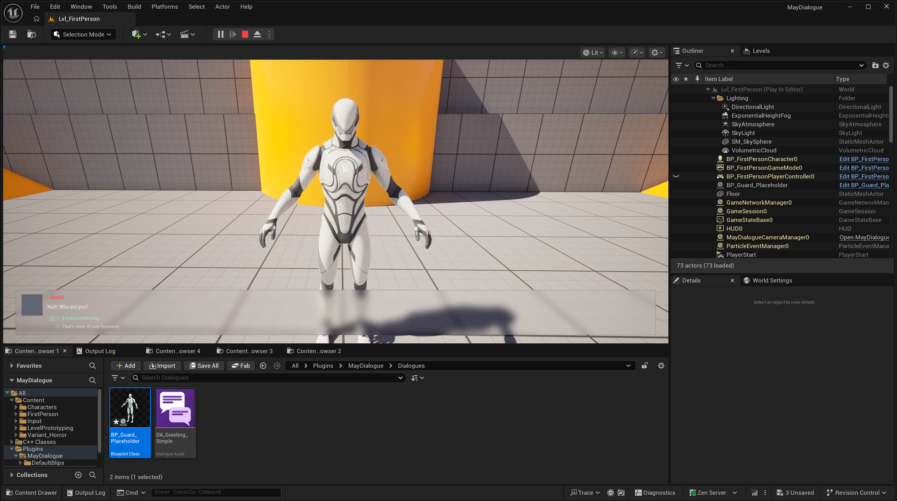


Du hast einen spielbaren Dialog ohne UMG-Setup, ohne Audio-Konfiguration und ohne Input-Handling-Code.


---

## Fehlerbehebung

<details>
<summary>Kein Widget erscheint beim Dialog-Start</summary>

Prüfe in **Edit → Project Settings → Plugins → MayDialogue**, ob `bUseSlateDialogueWidget` aktiviert ist. Standardmäßig erscheint das Slate-Debug-Widget auch ohne gesetztes UMG-Widget.
</details>

<details>
<summary>Dialog startet gar nicht</summary>

Prüfe:
* Hat das Asset einen Entry-Node und wurde es compiliert (Toolbar → Compile)?
* Hat der Wächter-Actor eine `MayDialogueParticipant`-Komponente mit dem richtigen Tag?
* Hat der Spieler-Pawn ebenfalls eine Participant-Komponente?
* Der Output-Log zeigt Warnungen, wenn etwas fehlt: dort nach `MayDialogue` suchen.
</details>

<details>
<summary>Die Frage erscheint, aber keine Choice-Buttons</summary>

Das passiert, wenn der PlayerChoice-Node keine verbundenen Output-Pins hat oder alle Choices aufgrund von Requirements verborgen sind. Öffne das Asset, prüfe die Choices-Liste im PlayerChoice-Node.
</details>

---

## Was als Nächstes?

* Variablen, Branching und GAS-Requirements kennenlernen → [Walkthrough](first-dialogue.md)
* Eigenes UMG-Widget statt Slate-Debug-Widget → [UI-Architektur](../ui/umg-architecture.md)
* Audio hinzufügen → [Audio-System](../audio/README.md)
* Choices an GAS-Attribute knüpfen → [GAS-Integration](../gas/README.md)
