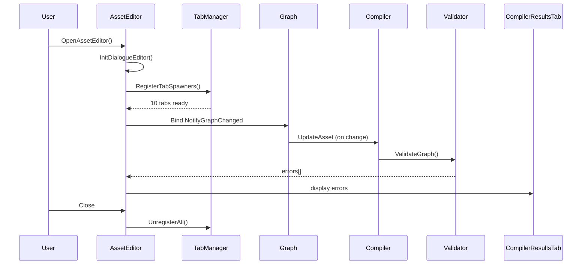

# Der Asset-Editor

`FMayDialogueAssetEditor` ist das **Asset-Editor-Toolkit** für MayDialogue-Assets. Doppelklick auf ein `UMayDialogueAsset` im Content Browser öffnet diesen Editor.

## Ein Asset anlegen

Drei Wege:

1. **Content Browser → Rechtsklick → Miscellaneous → MayDialogue Asset**.
2. **Create-Button im Content Browser → Miscellaneous → MayDialogue Asset**.
3. **Kopie eines bestehenden Assets** (Duplicate, dann Umbenennen).

Ein neues Asset enthält immer einen **Entry-Node** und eine leere Speaker-/Variable-Liste.

## Das Toolkit-Fenster

### Tabs

Der Editor hat **zehn Dock-Tabs**:

| Tab-ID | Inhalt | Default-Position |
| --- | --- | --- |
| `Graph` | Hauptgraph-Canvas | Mitte |
| `Details` | Property-Editor des aktuell selektierten Nodes | Rechts |
| `CompilerResults` | Warnings & Errors vom Validator/Compiler | Unten |
| `FindResults` | Ergebnisse von Find-in-Dialogue | Unten |
| `Palette` | Gefilterte Liste aller Node-Typen | Rechts/Links |
| `Variables` | Dialog- und Participant-Variablen des Assets | Rechts |
| `Speakers` | Sprecher-Liste des Assets | Rechts |
| `DebuggerWatch` | Variable-Watch (nur in PIE) | Unten |
| `Preview` | Live-Preview des Dialogs (Play-Button) | Rechts/Ausklappbar |
| `Outline` | Flache Liste aller Nodes | Links |

Alle Tabs sind frei andockbar; das Layout bleibt pro Benutzer erhalten.

### Toolbar-Buttons

Die Toolbar zeigt von links nach rechts:

| Button | Wirkung | Shortcut |
| --- | --- | --- |
| **Save** | Asset speichern | `Ctrl+S` |
| **Compile** | Validator → Compiler | `F7` |
| **Auto-Layout** | Sugiyama-artige Graph-Sortierung | – |
| **Play Dialog** | In-Editor-Preview starten | – |
| **Find** | Find-Results-Tab öffnen & fokussieren | `Ctrl+F` |
| **Toggle Breakpoint** | Am selektierten Node | `F9` |

Zusätzlich die Standard-Undo/Redo-Commands (`Ctrl+Z` / `Ctrl+Y`).

### Property-Auto-Compile

Wenn `bAutoCompileOnSave` in den Editor-Settings aktiv ist (Default), triggert jede Property-Änderung, die den Graph betrifft, automatisch eine neue Compile-Pass. Der `OnFinishedChangingProperties`-Callback im Toolkit ruft intern `CompileDialogue()`.

## Lifecycle des Editors

## Compile-Pfad

Die Toolbar-Aktion **Compile** (bzw. der Auto-Compile) macht:

1. `FMayDialogueValidator::ValidateGraph(Graph)` → `TArray<FMayDialogueValidationError>`.
2. Errors in den Compiler-Results-Tab pushen.
3. Wenn **keine** Errors (nur Warnings): `FMayDialogueCompiler::CompileDialogueAsset(Asset)`.
4. Erfolgsmeldung im Output-Log.

Wenn Errors vorhanden, **wird nicht kompiliert** – das Asset behält seinen letzten kompilierten Stand, der Graph bleibt editierbar, aber du kannst den alten Stand testen, bis du die Errors behebst.

## Tab: Compiler Results

Fehler- und Warn-Liste mit drei Spalten:

* **Severity** (Warning / Error)
* **Message** (z.B. *„Unconnected output pin"*)
* **Node** (klickbar – Kamera springt zum Node im Graph)

Siehe [Validator-Checks](asset-editor.md#validator-checks) weiter unten.

## Tab: Palette

Gruppiert Node-Typen nach Kategorie:

* **Dialogue**: SayLine, PlayerChoice, RandomLine.
* **Flow Control**: Branch, Wait, Link, SubGraph.
* **Actions**: Camera, Animation, Variable, Event, Sound.
* **Special**: Exit, Knot.

Drag-and-Drop aus der Palette in den Graph. Alternativ: Rechtsklick im Graph → Kontext-Menü zeigt dieselben Gruppen.

## Tab: Details

Standard-UE-Property-Editor. Zeigt die UPROPERTYs des selektierten Nodes.

Eine **Speaker-Dropdown**-Customization sorgt dafür, dass statt eines generischen GameplayTag-Pickers ein Dropdown mit den im Asset definierten Sprechern angezeigt wird (mit Farb-Chip + DisplayName). Siehe [Details Customization](../editor/comfort-features.md#speaker-dropdown).

## Validator-Checks

Der Validator prüft **15+ Regeln**:

| Check | Severity | Bedeutung |
| --- | --- | --- |
| Empty Graph | Error | Gar keine Nodes. |
| Missing Entry | Error | Kein Entry-Node. |
| Missing Exit | Warning | Kein Exit (Dialog kann unendlich loopen). |
| Multiple Entries | Error | Mehr als ein Entry. |
| Unconnected Pins | Error | Output-Pin ohne Ziel (außer Exits). |
| Empty Text | Error | SayLine/PlayerChoice ohne Text. |
| Unreachable Nodes | Warning | Nicht vom Entry erreichbar. |
| Missing Speakers | Error | SayLine/CameraFocus/PlayAnimation ohne Sprecher-Tag. |
| Self-Loops | Warning | Node verweist auf sich selbst. |
| Deadlocks | Error | Erreichbar, aber kein Pfad zum Exit. |
| Sub-Graph Issues | Error | SubGraph-Asset fehlt oder unvollständig. |
| Invalid Asset Refs | Error | Link-Node ohne Ziel-Asset. |
| Missing Requirements | Error | Branch ohne Condition. |
| Variable Type Mismatch | Error | SetVariable mit widersprüchlichen Typen auf derselben Variable. |
| Async Without Continuation | Warning | Wait/PlayAnimation mit `bWaitForMontageEnd` ohne Output. |

## Bekannte Einschränkungen

* **Keine Live-Validation.** Validator läuft beim Compile, nicht bei jeder Property-Änderung – bewusst so entschieden wegen Re-Entry-Problemen (siehe [Roadmap](../appendix/roadmap.md)).
* **Cross-Asset-Navigation bei Link-Nodes ist rudimentär.** Aktuell findet der Editor Link-Ziele nur im aktuellen Asset; Ziele in anderen Assets werden beim Step-Into nicht automatisch geöffnet.

Weiter: [Graph-Panel →](graph-panel.md).
