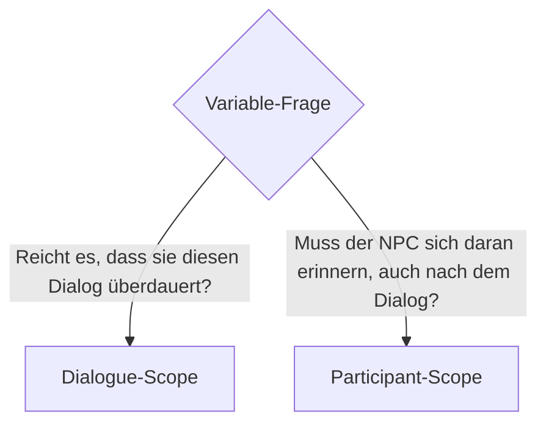

# Variables-Panel

Das Variables-Panel listet **alle Variablen des Dialog-Assets** – beide Scopes (Dialogue + Participant). Hier deklarierst du sie, setzt Defaults und hältst den Überblick.

## Anatomie

Pro Variable eine Zeile mit:

| Spalte | Bedeutung |
| --- | --- |
| **Name** | `FName`, muss im Scope eindeutig sein. |
| **Typ** | Bool / Int / Float / String / Tag. |
| **Scope** | Dialogue oder Participant. |
| **Default** | Initialwert. |
| **Beschreibung** | Optional, für Designer-Dokumentation. |

## Variable anlegen

1. **Add Variable** klicken.
2. Name eintippen.
3. Typ aus Dropdown wählen.
4. Scope wählen: Dialogue oder Participant.
5. Default-Wert setzen.
6. Optional: Beschreibung eintragen.

## Scope-Wahl – Entscheidungshilfe



### Typische Dialogue-Scope-Variablen

* `AngerLevel: Int` – Zählt Provokationen innerhalb des Gesprächs.
* `HasAskedName: Bool` – Verhindert doppeltes Name-Fragen.
* `SelectedTone: Tag` – Merkt sich den gewählten Antwort-Tonfall.

### Typische Participant-Scope-Variablen

* `HasMet: Bool` – Erster Kontakt?
* `Friendship: Float` – Beziehungs-Metrik.
* `KnownSecrets: Tag` – GameplayTag pro bekanntem Geheimnis.

## Variablen lesen/schreiben im Graph

### Lesen

Lesen passiert **nicht** direkt – du nutzt Requirements:

* **CheckDialogueVariable** (Projekt-eigen oder aus dem Plugin, je nach Version).
* **CheckParticipantVariable**.

### Schreiben

Zwei Wege:

1. **SetVariable-Action-Node** – als prominente Box im Flow.
2. **SetVariable-SideEffect-Sub-Node** – kompakt als Pill am Eltern-Node.

Beide Formulare zeigen dieselben Properties.

## Default-Werte

| Typ | Default-Syntax |
| --- | --- |
| Bool | `true` / `false` |
| Int | Ganzzahl |
| Float | Dezimal |
| String | Text-Feld |
| Tag | GameplayTag-Picker |

## Validator-Regel: Variable Type Mismatch

Wenn mehrere SetVariable-Nodes denselben Namen mit **unterschiedlichen Typen** beschreiben, meldet der Validator einen Fehler. Der Scope-Zugriff muss konsistent sein.

**Beispiel**:

```
Variable "AngerLevel" deklariert als Int.
SetVariable-Node A: setzt "AngerLevel" = 1 (Int). OK.
SetVariable-Node B: setzt "AngerLevel" = "High" (String). → Error.
```

## Variablen-Feedback im Preview / Debugger

Im **Preview-Runner** kannst du Variablen-Werte live sehen und manuell setzen – das erlaubt, Verzweigungen durchzuspielen, ohne echte Spieler-Aktionen zu simulieren.

Im **PIE-Debugger** zeigt der `DebuggerWatch`-Tab alle aktiven Variablen der gerade laufenden Instance – Dialog-Scope direkt aus der Instance, Participant-Scope aus den angebundenen Participants.

## Grenzen & Roadmap

* **Keine Rechenoperationen** im Graph (kein `x += 1` als Node). Wer das braucht, nutzt einen Blueprint-SideEffect, der `GetDialogueVariableInt` + `SetDialogueVariableInt` selbst kombiniert.
* **SetVariable-Node schreibt aktuell nur in Dialog-Scope**, nicht in Participant-PersistentMemory. Backlog-Item 8 – bis dahin: Blueprint-SideEffect-Workaround.
* **Tag-Wert im SetVariable** fehlt in der UI-Pfad-Implementierung (Backlog-Item 9).

Weiter: [Outline →](outline.md).
