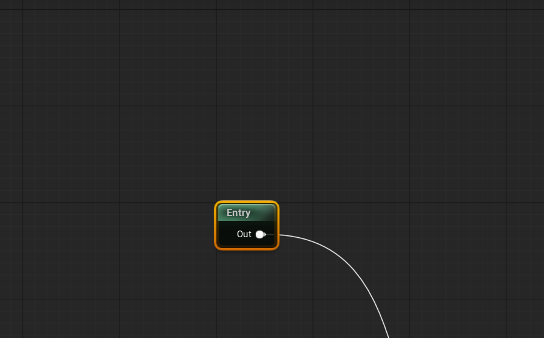
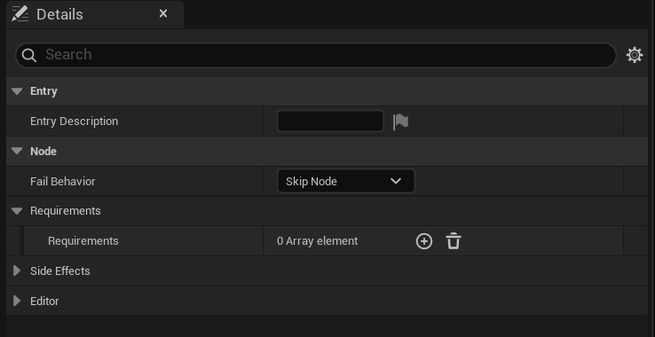

# Entry

The Entry Node is the start point of every dialogue asset. Each asset has exactly one — it is placed automatically on creation and cannot be deleted.

## When should I use it?

- Always: it is already there. You do not need to add it manually.
- Connect its Output pin to the first Node that should execute when the dialogue starts.
- Add SideEffects if an action should be triggered immediately at start (e.g. initializing a variable or setting a tag).

## Properties

| Property | Type | Default | Meaning |
| --- | --- | --- | --- |
| `EntryDescription` | `FText` | empty | Comment for the designer — does not appear in game. |
| `SideEffects` | Array | empty | Inline actions executed at dialogue start (e.g. set variable, add tag). |
| `FailBehavior` | Enum | `Skip` | Behavior when Node Requirements fail (inherited from Base). |
| `EditorComment` | `FText` | empty | Graph note, no runtime effect. |


`EntryDescription` helps teams understand the entry point — especially useful when you have multiple sub-graphs with their own Entry Nodes in the same asset.






## Mini Example

```text
[Entry]
  SideEffect: AddTag Story.Met.Guard
  │
  ▼
[SayLine: Guard | "Halt! Who are you?"]
  │
  ▼
[PlayerChoice: ...]
```

> 📸 **Image placeholder:** `entry-example-graph.png` — Example graph with Entry + SideEffect.
> *Setup:* Graph with three Nodes: `Entry` (SideEffect pill `AddTag: Story.Met.Guard`) → `SayLine "Halt! Who are you?"` → `PlayerChoice`. Connections: Entry Output → SayLine Input, SayLine Output → PlayerChoice Input.

## Common Pitfalls

- **No Output pin connected**: The compiler reports an error. Always connect the Entry Output to the first content Node.
- **Multiple Entry Nodes**: The validator reports an error — only one per main graph is allowed. (Sub-graphs have their own Entry Node, which is correct.)
