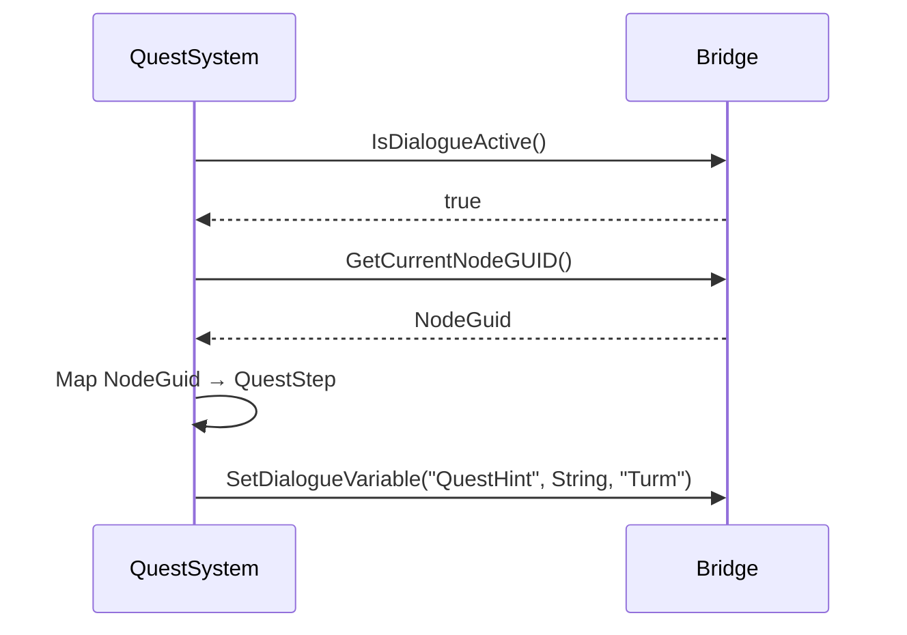

# Bridge implementieren

Wenn du ein **externes System** (z.B. MayFlowGraph, eigener Visual-Scripter, externer Editor) hast, das Dialoge konsumieren oder starten soll — **ohne** direkten Modul-Link auf `MayDialogue` — nutzt du die Bridge.

## Warum Bridge?

Die `IMayDialogueBridge`-Schnittstelle ist **klein, stabil, versionsresistent**. Externe Systeme haben eine Mini-Schnittstelle statt einer harten Klassen-Dependency auf Internas.

## Bridge-Methoden

```cpp
class IMayDialogueBridge
{
public:
    // Lifecycle
    virtual UMayDialogueInstance* StartDialogueFromBridge(UMayDialogueAsset*, AActor*, AActor*) = 0;
    virtual bool CanStartDialogue(UMayDialogueAsset*, AActor*, AActor*) const = 0;
    virtual bool IsDialogueActive() const = 0;
    virtual void AbortDialogue() = 0;

    // Control
    virtual void SelectChoice(int32 Index) = 0;
    virtual void ForceAdvance() = 0;

    // Read
    virtual UMayDialogueAsset* GetActiveDialogueAsset() const = 0;
    virtual FGuid GetCurrentNodeGUID() const = 0;
    virtual TArray<AActor*> GetActiveParticipants() const = 0;
    virtual bool GetDialogueVariable(FName, EMayDialogueVariableType, FString& Out) const = 0;
    virtual bool GetParticipantVariable(FGameplayTag, FName, EMayDialogueVariableType, FString& Out) const = 0;
    virtual TArray<FMayDialogueChoiceEntry> GetPendingChoices() const = 0;

    // Write
    virtual bool SetDialogueVariable(FName, EMayDialogueVariableType, const FString& ValueAsString) = 0;
    virtual bool SetParticipantVariable(FGameplayTag, FName, EMayDialogueVariableType, const FString& ValueAsString) = 0;
};
```

## Consumer-Seite: Bridge nutzen

Wenn dein externes System Dialog-State **liest** oder **schreibt**:

```cpp
// 1. Subsystem holen
UMayDialogueSubsystem* Sub = UMayDialogueSubsystem::Get(GetWorld());

// 2. Als Bridge casten (impliziert, da Subsystem das Interface implementiert)
IMayDialogueBridge* Bridge = Sub;

// 3. Methoden nutzen
if (Bridge->IsDialogueActive())
{
    FGuid CurrentNode = Bridge->GetCurrentNodeGUID();
    TArray<AActor*> Parts = Bridge->GetActiveParticipants();
    // ...
}
```

Dein externes System hat damit **keinen** Include auf `MayDialogueSubsystem.h` — nur auf `MayDialogueBridge.h`. Das reduziert Build-Kopplung.

## Provider-Seite: Eigene Bridge-Implementation

Theoretisch kannst du **eine eigene Klasse** schreiben, die `IMayDialogueBridge` implementiert — z.B. für Test-Mocks oder für ein paralleles Dialog-System, das dieselbe API exposed.

```cpp
class FMockDialogueBridge : public IMayDialogueBridge
{
public:
    virtual bool IsDialogueActive() const override { return true; }
    virtual TArray<FMayDialogueChoiceEntry> GetPendingChoices() const override { return Mocked; }
    // ... alle anderen Methoden implementieren
private:
    TArray<FMayDialogueChoiceEntry> Mocked;
};
```

Das ist nur in Test-Szenarien praktisch.

## Lifecycle-Events via Subsystem

Die Bridge liefert **keine** Delegates. Wenn dein externes System auf Events reagieren will, bindest du dich zusätzlich an die Subsystem-Delegates:

```cpp
Sub->OnAnyDialogueStarted.AddDynamic(this, &UMyExt::HandleStart);
Sub->OnAnyDialogueEnded.AddDynamic(this, &UMyExt::HandleEnd);
```

Oder pro-Instance:

```cpp
Instance->OnChoiceMade.AddDynamic(this, &UMyExt::HandleChoice);
```

## Typischer Integration-Flow



## Anmerkungen

* Die Bridge ist ein **UE-Interface** (`UINTERFACE`), d.h. C++-Klassen müssen `TScriptInterface<IMayDialogueBridge>` nutzen oder `Cast<>`.
* String-basierte Variable-API ist **gewollt** — macht Cross-System-Kopplung typ-agnostisch.
* Bridge-Methoden sind **nicht repliziert**. Für Multiplayer-Kommunikation zwischen externen Systemen: eigene RPCs.
