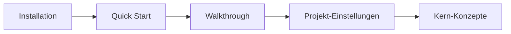

# Erste Schritte

Dieser Abschnitt bringt dich in der kürzest-möglichen Zeit zu einem spielbaren Dialog. Du brauchst:

* **Unreal Engine 5.7** (Binary- oder Source-Build).
* Ein **aktives Projekt**, in das du das Plugin kopieren kannst.
* Grundkenntnisse in Blueprint *oder* C++. Tiefe Plugin-Interna sind **nicht** nötig.

## Die drei Meilensteine

1. **Installation** – Plugin-Ordner nach `Plugins/` kopieren, Projekt neu generieren, Editor öffnen. Schritt für Schritt in [Installation](installation.md).
2. **Quick Start** – In fünf Minuten ein NPC-Dialog im Level. Schritt für Schritt in [Quick Start](quick-start.md).
3. **Walkthrough** – Ein vollständiger Dialog mit Branching, Variablen, GAS und Choice-Requirements. Schritt für Schritt in [Walkthrough](first-dialogue.md).

## Empfohlene Reihenfolge

Nachdem du den Walkthrough durch hast, stöbere in den [Kern-Konzepten](../concepts/README.md), um das mentale Modell zu festigen. Anschließend kannst du dich gezielt einzelnen Kapiteln zuwenden – [UI](../ui/README.md), [Audio](../audio/README.md), [GAS](../gas/README.md) oder [Rezepte](../recipes/README.md).


**Binary-Installs brauchen einen Rebuild.** Sobald du C++-Klassen hinzufügst (eigene Nodes, Requirements oder SideEffects), muss dein Projekt einen C++-Code-Modul haben und rebuilt werden. Reine Blueprint-Projekte können das Plugin als Binary-Distribution verwenden, ohne selbst zu kompilieren.

