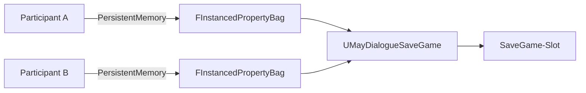

# Persistence

Participant-Variablen können den Dialog überdauern und mit UE's SaveGame-System synchronisiert werden. Dieses Kapitel zeigt, wie.

## Philosophie

* MayDialogue **liefert kein eigenes SaveGame-System**.
* `UMayDialogueParticipant::PersistentMemory` ist als `SaveGame`-UPROPERTY markiert – wenn dein Projekt einen SaveGame-Mechanismus hat, wird es mitgesichert.
* Für Projekte **ohne** eigenes SaveGame-System gibt es den minimalen [QuickSave-Helper](quicksave-helper.md) als Startpunkt.

## Kapitel

* [SaveGame-Integration](save-integration.md) – wie sich MayDialogue in dein SaveGame einhängt.
* [Participant-Memory](participant-memory.md) – was PersistentMemory kann.
* [QuickSave-Helper](quicksave-helper.md) – der mitgelieferte Fallback.

## Zusammenhang

## Dialogue-Scope wird NICHT gespeichert

Variablen im Dialogue-Scope (`FInstancedPropertyBag` auf `UMayDialogueInstance`) sind per Definition temporär. Sie leben nur während des Gesprächs. Persistenz ist ausschließlich für Participant-Scope gedacht.
