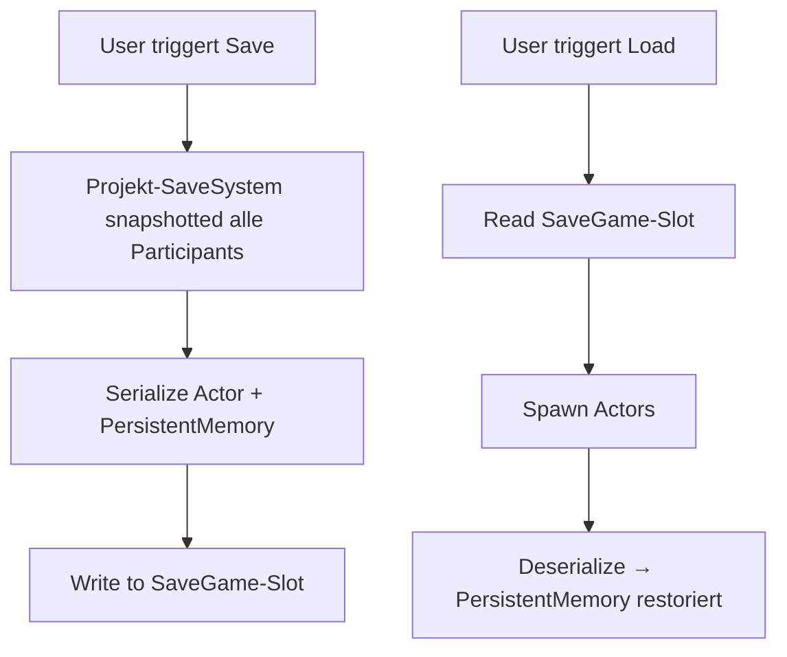

# SaveGame-Integration

Wenn dein Projekt bereits ein eigenes SaveGame-System hat, kannst du MayDialogues Participant-Memory nahtlos einbetten.

## Das `SaveGame`-Flag

Auf der Participant-Komponente:

```cpp
UPROPERTY(EditAnywhere, BlueprintReadWrite, SaveGame, Category="Persistence")
FInstancedPropertyBag PersistentMemory;
```

Das `SaveGame`-Specifier sorgt dafür, dass UE's `FArchive`-Serialisierung die Property in ein SaveGame einbettet, **sofern** der Serializer auf `SaveGame`-Flag hört.

## Standard-UE-Archive

Der übliche Code für Actor-Snapshot:

```cpp
FMemoryWriter Writer(OutBytes);
FObjectAndNameAsStringProxyArchive Ar(Writer, /*bLoadIfFindFails=*/false);
Ar.ArIsSaveGame = true;

Actor->Serialize(Ar);
```

`ArIsSaveGame = true` bewirkt, dass nur Properties mit `SaveGame`-Flag serialisiert werden. Deine `PersistentMemory` ist dabei.

## Beim Laden

Inverse Richtung:

```cpp
FMemoryReader Reader(InBytes);
FObjectAndNameAsStringProxyArchive Ar(Reader, false);
Ar.ArIsSaveGame = true;

Actor->Serialize(Ar);
```

UE stellt die Property wieder her. Die `FInstancedPropertyBag` kennt ihr Schema und deserialisiert sauber.

## Empfohlener Projekt-Flow



## Was genau wird gespeichert?

Pro Participant die `PersistentMemory`-PropertyBag. Das ist ein **typed-dynamic Dictionary**: Bool, Int, Float, String, Tag-Paare. Jede Variable, die du via `SetPersistentXxx()` geschrieben hast, lebt dort.

**Nicht** gespeichert:

* Aktuell laufende Dialog-Instance (sie wird beim Load neu gestartet, falls nötig).
* Dialogue-Scope-Variablen der alten Instance.
* UI-State.

## Actor-Spawning-Sync

Wichtig: PersistentMemory überlebt nur, wenn die **Participant-Komponente am gleichen Actor** re-instanziiert wird. Typisches Muster:

1. Level hat NPC „Guard_01".
2. Beim Save: Actor-Identität (Name oder Guid) + PersistentMemory werden gespeichert.
3. Beim Load: Level wird geladen, NPC erscheint, `PersistentMemory` wird aus SaveGame restoriert (z.B. über einen `ISaveLoadInterface` am Actor oder via AssetRegistry-Matching).

Wenn dein Projekt Actors nicht im Level-File hat, sondern dynamisch spawnt: sorge dafür, dass der Re-Spawn-Pfad dieselbe ParticipantTag-Identität hat.

## Alternative: Manuelles Persistieren

Wenn du die PropertyBag nicht über den Standard-Archive-Pfad speichern willst, kannst du sie auch **explizit** aus dem Participant holen:

```cpp
FInstancedPropertyBag Memory = Part->PersistentMemory;
// in dein eigenes SaveGame packen
```

Und beim Load:

```cpp
Part->PersistentMemory = LoadedMemory;
```

Das ist flexibler, erfordert aber dass du die Sync-Point selbst orchestrierst.

## Global Memory (optional)

`UMayDialogueSaveGame` hat zusätzlich ein `GlobalMemory`-Feld (`FInstancedPropertyBag`), das du für Projekt-weite Dialog-Flags nutzen kannst, die keinem Participant gehören (z.B. *„Hat der Spieler das Intro-Video gesehen?"*). Zugriff via Projekt-Code.
