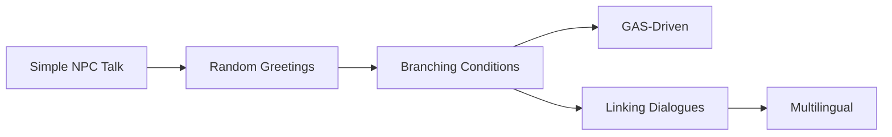

# Rezepte

Die Rezept-Galerie sammelt **fertige Lösungs-Muster** für wiederkehrende Dialog-Aufgaben. Jedes Rezept ist so aufgebaut, dass du es in ca. 10 Minuten nachbauen und auf dein Projekt übertragen kannst.

## Aufbau eines Rezepts

Jede Seite folgt demselben Schema:

1. **Szenario** – eine kurze Geschichte, in der das Pattern gebraucht wird.
2. **Beteiligte Nodes** – welche Bausteine aus dem [Node-Katalog](../nodes/README.md) zum Einsatz kommen.
3. **Graph-Mock-Up** – ASCII-Skizze des Dialog-Flows, damit du beim Nachbauen im Editor keine Node suchst.
4. **Schritt-für-Schritt** – konkrete Klicks im Asset-Editor.
5. **Snippet(s)** – C++- oder Blueprint-Pseudosyntax für Runtime-Trigger.
6. **Troubleshooting** – die drei häufigsten Stolperfallen.

## Voraussetzungen

Bevor du ein Rezept nachbaust, solltest du das [Quick-Start-Tutorial](../getting-started/quick-start.md) absolviert haben. Außerdem macht es Sinn, diese drei Konzeptseiten gelesen zu haben:

* [Instance & Lifecycle](../concepts/instance-lifecycle.md)
* [Participants & Sprecher](../concepts/participants-speakers.md)
* [Variablen & Scopes](../concepts/variables-scopes.md)

Ohne die wirst du die Rezepte zwar abtippen können, aber die Begründungen hinter den Entscheidungen entgehen dir.

## Überblick der Rezepte

| Rezept | Was du lernst | Zeitaufwand |
| --- | --- | --- |
| [Einfaches NPC-Gespräch](simple-npc-talk.md) | Minimal-Setup: Entry → SayLines → Exit, richtige Advance-Modi. | 5 Min |
| [Verzweigungen mit Bedingungen](branching-conditions.md) | Branch-Node + GAS-Requirement, um Spielverhalten zu belohnen. | 10 Min |
| [Zufällige Begrüßungen](random-greetings.md) | RandomLine für variable NPC-Greetings, Weight-Tuning. | 5 Min |
| [Wiederverwendbare Dialog-Fragmente](linking-dialogues.md) | Link-Node vs. SubGraph, wann welche Variante. | 10 Min |
| [GAS-getriebener Dialog](gas-driven-dialogue.md) | ApplyEffect + AddTag/RemoveTag + CheckAttribute im Verbund. | 15 Min |
| [Mehrsprachigkeit](multilingual-dialogue.md) | VoicePerCulture-Map + FText-Gather-Workflow. | 10 Min |

## Empfohlene Reihenfolge

Wenn du alle sechs nacheinander durchgehst, empfiehlt sich diese Reihenfolge:

Die Rezepte bauen thematisch aufeinander auf: Talk → Variation → Bedingungen → GAS → Wiederverwendung → Lokalisierung.

## Was nicht in den Rezepten steht

Diese Themen haben eigene Kapitel und werden hier nur punktuell gestreift:

* **Eigene Nodes schreiben** → [Erweiterung → Custom Nodes](../extension/custom-nodes.md)
* **Eigene Requirements** → [Erweiterung → Custom Requirements](../extension/custom-requirements.md)
* **SaveGame-Integration** → [Persistence](../persistence/README.md)
* **UI-Theming** → [UI → Themes & Starterkits](../ui/themes.md)
* **Babel-Synthese-Profile** → [Audio → Babel-Profile](../audio/babel-profiles.md)

## Konventionen in den Snippets

In den Code-Blöcken wirst du diese Abkürzungen sehen:

| Kürzel | Bedeutung |
| --- | --- |
| `Sub` | `UMayDialogueSubsystem*` |
| `Inst` | `UMayDialogueInstance*` |
| `Asset` | `UMayDialogueAsset*` |
| `PC` | `APlayerController*` |
| `NPC` | Gegnerischer / Gesprächspartner-Actor |

Die Rezepte sind bewusst kompakt gehalten – komplette Boilerplate findest du in [Runtime → Einen Dialog starten](../runtime/starting-dialogues.md).


Alle Rezepte gehen davon aus, dass du das Plugin laut [Installation](../getting-started/installation.md) in dein Projekt integriert hast und dass in den [Projekt-Einstellungen](../getting-started/project-settings.md) ein Dialog-Widget konfiguriert ist.


## Rezepte beitragen

Hast du ein eigenes Muster gefunden, das in dieser Galerie fehlt? Schick einen Pull-Request auf das Plugin-Repo – ideal mit einem kleinen Demo-Asset und einer Screenshot-GIF.
