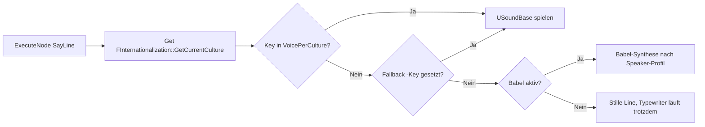

# Mehrsprachigkeit

MayDialogue unterstützt Lokalisierung auf zwei Ebenen: **Text** über das Standard-UE-Gather-System (`FText`) und **Voice** über die `VoicePerCulture`-Map am SayLine-Node. Dieses Rezept zeigt dir den kompletten Workflow von der Kultur-Konfiguration bis zur getesteten Zeile.

## Szenario

Dein Horror-Spiel soll in Deutsch, Englisch und Japanisch erscheinen. Ein NPC sagt zwei Zeilen mit Vertonung. Jede Kultur hat eigenen Text und eigene Voice-Files.

## Voraussetzungen

* UE-Projekt hat mindestens zwei Cultures unter *Edit → Project Settings → Packaging → Localization*.
* Ein *Localization Target* für das Projekt (`Game.po` / `Game.locres`) existiert.
* Voice-Files als `USoundBase` (Wave oder MetaSound) importiert, benannt z.B. `SW_Villager_Line01_DE`, `SW_Villager_Line01_EN`, `SW_Villager_Line01_JA`.

## Schritt-für-Schritt

### 1. Kulturen im Projekt registrieren

In den *Project Settings → Internationalization*:

* Native Culture: `de`
* Cultures to Stage: `de`, `en`, `ja`

Damit landen die Culture-Keys in den `.locres`-Files.

### 2. Dialog-Asset anlegen

`DA_Villager_Intro`. SayLine mit Text in *Native-Culture* (hier Deutsch):

| Property | Wert |
| --- | --- |
| `DialogueText` | *„Guten Tag, Fremder."* |

`FText` merkt sich beim Asset-Save automatisch einen *Text Key*, den das Gather-System später nutzt.

### 3. Voice-per-Culture-Map füllen

Am SayLine-Node hat `DialogueVoice` den Typ `TMap<FString, USoundBase*>`. Füge drei Einträge hinzu:

| Key | Value |
| --- | --- |
| `de` | `SW_Villager_Line01_DE` |
| `en` | `SW_Villager_Line01_EN` |
| `ja` | `SW_Villager_Line01_JA` |


Der Fallback-Key ist konventionsmäßig `""` (leerer String). Wenn du ihn setzt, wird er als Voice verwendet, falls die aktuelle Kultur nicht gefunden wird. Lasse das Feld aber nur dann leer, wenn du stattdessen Babel-Synthese aktivieren willst.


### 4. Text-Gather ausführen

*Window → Localization Dashboard* öffnen. Im Dialog-Localization-Target:

1. *Gather Text* ausführen – scanned alle Assets inkl. Dialog-Graphs.
2. *Compile Text* – erzeugt die `.locres`.
3. *Edit* öffnet den Culture-Editor, in dem du die englische und japanische Übersetzung des Textes einträgst.

Alternativ per CLI:

```bash
"C:/Program Files/Epic Games/UE_5.7/Engine/Binaries/Win64/UnrealEditor-Cmd.exe" ^
  "C:/UnrealEngine/VHS/VHS.uproject" ^
  -run=GatherText ^
  -Target=Game
```

### 5. Runtime-Sprachwechsel

Culture wird von UE gesetzt. Typische Wege:

**Blueprint**:

```
[Set Current Culture]   "en"
```

**C++**:

```cpp
FInternationalization::Get().SetCurrentCulture(TEXT("en"));
```

Beim nächsten Dialog-Start nutzt das Plugin die neue Kultur sowohl für Text-Darstellung (`FText::AsCultureInvariant()` bleibt die Ausnahme) als auch für Voice-Auswahl.

## Wie die Voice-Auflösung funktioniert



Die [Drei-Ebenen-Fallback-Kette](../audio/three-level-fallback.md) kommt zusätzlich ins Spiel, wenn der Speaker-Override oder Babel-Profil-Override eingreift.

## Voice-Files organisieren

Eine bewährte Projekt-Struktur:

```
Content/
  Dialogue/
    Villager/
      DA_Villager_Intro.uasset
      Voice/
        de/SW_Villager_Line01.wav
        en/SW_Villager_Line01.wav
        ja/SW_Villager_Line01.wav
```

Durch die Kultur-Ordner kannst du in Perforce gezielt Culture-Sets staged/shipped ein- oder ausschließen (*Asset Staging Rules* im Packaging-Abschnitt).

## Mix: Teilweise Vertonung

Nicht jede Zeile muss alle Kulturen bedienen. Typisches Muster:

| Szenario | Setup |
| --- | --- |
| Nur Englisch vertont, andere nur Text | Einzigen `en`-Key füllen, Rest leer → Babel oder Stille bei anderen Cultures. |
| Deutsch + Englisch vertont, Japanisch nur Text | `de` + `en` im Map, `ja` leer → Plugin fällt bei `ja` auf Babel oder Stille. |
| Alle Cultures Babel, nur Schlüsselzeilen vertont | VoiceMap pro SayLine selektiv befüllen. |

## Lokalisierungs-Best-Practices

* **FText nie per `FromString`** bauen. Das verhindert Gather.
* **Namespace pro Asset** setzen. `FText`s in einem Asset bekommen automatisch einen Namespace aus dem Asset-Pfad – damit keine Kollisionen mit gleichem String in anderen Assets.
* **EmotionTags** als `FGameplayTag` sind nicht lokalisierbar (sollen sie auch nicht sein – das sind Daten, kein Display-Text).
* **Speaker-DisplayName** ebenfalls als `FText` pflegen, nicht als `FString`.

## Troubleshooting

### Die englische Voice wird abgespielt, der Text bleibt deutsch

* Das Localization-Target wurde nicht *Compiled* nach dem Gather. Die `.locres` fehlt. Re-Run *Compile Text*.
* Die Kultur wurde nicht gesetzt – prüfe mit `FInternationalization::Get().GetCurrentCulture()`.

### Der Voice-Fallback greift nicht

* Der leere `""`-Key ist nicht gefüllt. Entweder Babel aktivieren ([bEnableBabelVoice](../getting-started/project-settings.md)) oder den leeren Key explizit mit einer generischen Default-Voice belegen.

### Fonts haben keine japanischen Glyphen

* Das ist kein MayDialogue-Problem, sondern ein UMG-Font-Thema. Dein Dialog-Widget braucht einen Font mit CJK-Support oder eine Font-Fallback-Kette. Siehe UE-Docs zu *Composite Font Assets*.

### Gather findet den Text nicht

* Der Text wurde per Blueprint-Literal in ein Variable-Feld gelegt statt am Asset. Dialog-Graphs werden gegathered, aber nur die Properties vom Typ `FText`.

## Nächster Schritt

* [Audio → Lokalisierung (VoicePerCulture)](../audio/localization.md) – tiefergehende Erklärung der Map, Wildcard-Keys und Culture-Subtypes.
* [Audio → Babel-System](../audio/babel-system.md) – wenn du für manche Kulturen keine Voice-Aufnahme hast und lieber prozedural synthetisierst.
* [Wiederverwendbare Dialog-Fragmente](linking-dialogues.md) – dasselbe Fragment, das du hier in mehrere Sprachen übersetzt hast, teilen alle NPCs, die dieses Farewell nutzen.
