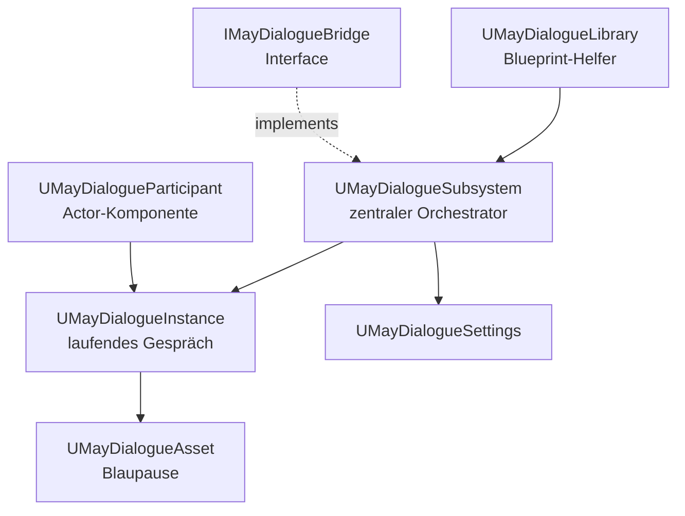

# Referenz

Die Referenz-Kapitel sind bewusst **straff und nachschlagbar** gehalten. Während die anderen Teile der Dokumentation Geschichten erzählen und Muster erklären, findest du hier die reinen Fakten: Property-Tabellen, Signaturen und Enum-Werte.

## Was du in der Referenz findest

| Seite | Inhalt | Wann öffnen |
| --- | --- | --- |
| [Projekt-Einstellungen](project-settings.md) | Alle Felder von `UMayDialogueSettings` in kompakter Tabelle. | Wenn du schnell wissen musst, was ein Setting tut. |
| [Editor-Einstellungen](editor-settings.md) | Alle Felder von `UMayDialogueEditorSettings`. | Node-Farben anpassen, Debug-Colors ändern. |
| [MayDialogueLibrary](api-library.md) | Alle BlueprintCallable-Methoden der Library. | Dialog-Start aus Blueprint / Widget-Graph. |
| [MayDialogueSubsystem](api-subsystem.md) | Public-Methoden und Delegates des Subsystems. | C++-Integration, Multi-Event-Binding. |
| [Delegates & Events](api-delegates.md) | Alle Delegate-Typen, ihre Parameter und Feuer-Punkte. | Game-System auf Dialog-Phasen horchen lassen. |
| [Typen & Enums](types.md) | Alle Enums und Structs des Plugins mit je einem Satz. | Auto-Complete-Rückschläge klären, TaskResult-Flow verstehen. |

## Was **nicht** hier steht

* **Konzept-Erklärungen** → [Kern-Konzepte](../concepts/README.md)
* **Node-Details** → [Node-Referenz](../nodes/README.md)
* **GAS-spezifische Requirements/Actions** → [GAS-Integration](../gas/README.md)
* **UI-Widget-APIs** → [UI-System](../ui/README.md)

## Wie die Property-Tabellen zu lesen sind

Die Tabellen folgen überall demselben Schema:

| Property | Typ | Default | Bedeutung |
| --- | --- | --- | --- |

**Typ-Konventionen**:

* `TSoftObjectPtr<T>` / `TSoftClassPtr<T>` → Lazy-Reference, wird erst beim Start geladen.
* `TArray<T>` → geordnet, 0-basiert.
* `TMap<K,V>` → string-keyed wenn nicht anders vermerkt.
* `FGameplayTag` / `FGameplayTagContainer` → aus dem UE-GameplayTags-System.
* Kein Default angegeben → zero-initialized bzw. `nullptr`.

## Wie die API-Signaturen zu lesen sind

```cpp
ReturnType  MethodName(Param1 P1, Param2 P2);   // ← die Signatur
// Kurze Beschreibung: Was die Methode macht, wann du sie aufrufst.
```

Alle Methoden sind – falls nicht anders vermerkt – sicher bei `nullptr`-Eingaben (sie loggen einen Warn und liefern `false` / `nullptr` zurück). Das Plugin vermeidet Crashes aggressiv, damit Designer-Iteration flüssig bleibt.

## Versions-Hinweis

Die Referenz spiegelt den Stand der Plugin-Quelle in diesem Repository. Wenn du MayDialogue in ein anderes Projekt überträgst, vergleiche die Header-Dateien:

```
Plugins/MayDialogue/Source/MayDialogue/Runtime/
Plugins/MayDialogue/Source/MayDialogueEditor/
Plugins/MayDialogue/Source/MayDialogueGAS/
```

Für Breaking Changes zwischen Plugin-Versionen siehe die [Roadmap](../appendix/roadmap.md).

## Quick-Look: Welche Klasse ist wofür zuständig



## Feedback

Fehler in einer Tabelle gefunden? Falscher Default-Wert? Erzähl es im Plugin-Repo – Referenzen altern schnell, besonders wenn Backlog-Items durch das Codebase rauschen.

## Tipp für schnelles Nachschlagen

Öffne im Editor *Window → Content Browser → Filter (Type)* und lass dir alle MayDialogue-Typen anzeigen. Der Hover-Tooltip pro Asset-Typ referenziert den entsprechenden Referenz-Abschnitt hier im Docs-Baum. Kein Klick ins Browser-Fenster mehr nötig, wenn dein Team die Dokumentation lokal cached.

Gut, jetzt aber zur Sache:

* [Weiter: Projekt-Einstellungen](project-settings.md)
