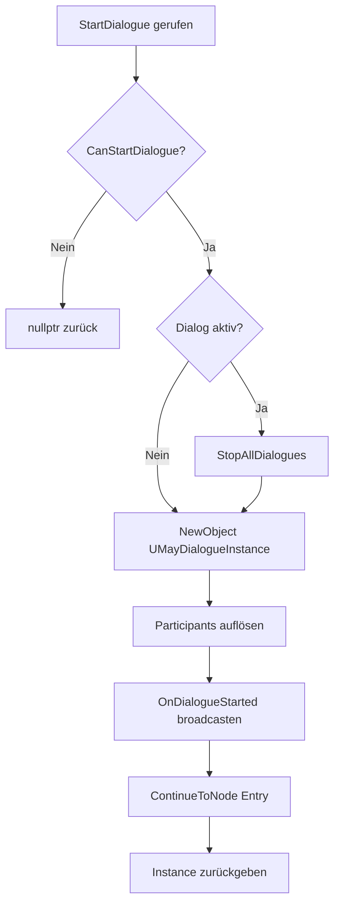

# `UMayDialogueSubsystem` (Referenz)

Der zentrale Orchestrator. Ein `UWorldSubsystem`, pro Welt genau eine Instanz. Implementiert zusätzlich `FTickableGameObject` (für Auto-Advance / Async-Watchdog) und `IMayDialogueBridge` (für externe Konsumenten).

* **Header**: `Source/MayDialogue/Runtime/MayDialogueSubsystem.h`
* **Modul**: `MayDialogue`
* **Base**: `UWorldSubsystem`
* **Interfaces**: `FTickableGameObject`, `IMayDialogueBridge`

## Zugriff

```cpp
// C++
UMayDialogueSubsystem* Sub = UMayDialogueSubsystem::Get(World);

// Blueprint
[Get World Subsystem (MayDialogue Subsystem)]
```

Oder via Library-Kurzform:

```cpp
UMayDialogueLibrary::GetDialogueSubsystem(WorldContext);
```

## Lifecycle-Methoden

| Signatur | Beschreibung |
| --- | --- |
| `UMayDialogueInstance* StartDialogue(Asset, Instigator, Target)` | Pre-Flight → Instance erzeugen → Entry ansteuern. Liefert Instance oder `nullptr`. |
| `bool CanStartDialogue(Asset, Instigator, Target) const` | Reiner Query; klärt, ob `StartDialogue` klappen würde. |
| `void StopDialogue(UMayDialogueInstance* Instance)` | Abortet die angegebene Instance. |
| `void StopAllDialogues()` | Abortet alle aktiven Instances. |

### StartDialogue-Flow



## Query-Methoden

| Signatur | Beschreibung |
| --- | --- |
| `UMayDialogueInstance* GetActiveDialogue() const` | Liefert die (einzige) aktive Instance oder `nullptr`. |
| `bool IsAnyDialogueActive() const` | Kurz-Query. |
| `const TArray<UMayDialogueInstance*>& GetAllActiveDialogues() const` | In Seltenst-Fällen: Alle Instances (sollte ≤ 1 sein). |

## Tick-Verantwortlichkeiten

Das Subsystem implementiert `FTickableGameObject::Tick(DeltaTime)`. Jeden Frame:

1. Camera-Blend-Fortschritt (bei aktivem CameraFocus).
2. Auto-Advance-Timer dekrementieren (AdvanceMode `Timer`).
3. Choice-Timeouts dekrementieren.
4. Async-Node-Watchdogs prüfen.
5. `CleanupCompletedDialogues()` – am Frame-Ende entsorgte Instances wegräumen.

Du musst **nie** selbst ticken.

## Subsystem-Delegates

```cpp
UPROPERTY(BlueprintAssignable, Category="Dialogue|Events")
FOnAnyDialogueEvent OnAnyDialogueStarted;

UPROPERTY(BlueprintAssignable, Category="Dialogue|Events")
FOnAnyDialogueEvent OnAnyDialogueEnded;
```

Typ `FOnAnyDialogueEvent` ist ein `DYNAMIC_MULTICAST_DELEGATE_OneParam(UMayDialogueInstance*)`. Das Delegate feuert **pro Instance**, egal wie viele parallel laufen. In der Regel jedoch nur eine.

Beispiel-Binding in C++:

```cpp
Sub->OnAnyDialogueStarted.AddDynamic(this, &AQuestLog::HandleDialogueStarted);

void AQuestLog::HandleDialogueStarted(UMayDialogueInstance* Instance)
{
    UE_LOG(LogQuest, Log, TEXT("Dialog %s gestartet"),
        *GetNameSafe(Instance->GetDialogueAsset()));
}
```

Blueprint-Binding:

```
[Get Dialogue Subsystem]
    │
    ▼
[Bind Event to On Any Dialogue Started]  ──► Ziel-Event
```

## `IMayDialogueBridge`-Implementierung

Das Subsystem implementiert die `IMayDialogueBridge`-Methoden weiter. Damit können externe Module MayDialogue **ausschließlich** über das Interface konsumieren:

| Interface-Methode | Rückgabe |
| --- | --- |
| `GetActiveDialogueAsset()` | Aktuelles Host-Asset oder nullptr. |
| `GetCurrentNodeGUID()` | GUID des aktuell laufenden Nodes. |
| `GetActiveParticipants()` | Alle Participant-Actors im aktiven Dialog. |
| `GetDialogueVariable(Name, Type, OutString)` | Liest eine Dialogue-Variable. |
| `GetParticipantVariable(ParticipantTag, Name, Type, OutString)` | Liest eine Participant-Variable. |
| `IsDialogueActive()` | Wrapper um `IsAnyDialogueActive`. |

Details zum Interface: [Runtime → Bridge & Lifecycle-Events](../runtime/bridge-events.md).

## Per-Instance-Delegates

Die Instance selbst hat **eigene** Delegates (siehe [Delegates & Events](api-delegates.md)). Diese sind pro Gespräch, während die Subsystem-Delegates global sind. Faustregel:

| Ziel | Wo binden |
| --- | --- |
| Alle Dialoge im Spiel | Subsystem (`OnAnyDialogueStarted/Ended`). |
| Nur ein bestimmtes Gespräch | Instance (`OnDialogueStarted/Ended`). |

## Deinitialisierung

Beim Welt-Wechsel ruft UE `Deinitialize()`:

1. `StopAllDialogues()` – alle Instances sauber abbrechen.
2. Timer/Delegates auf der Welt detachen.
3. `CleanupCompletedDialogues()` final.

Nach `Deinitialize` ist das Subsystem gone – neue Welt bekommt frisches Objekt.

## Replikation

Das Subsystem ist **nicht repliziert** (jeder Client hat eigenes `UWorldSubsystem`-Objekt). Multiplayer-Sync läuft über Participant-RPCs, siehe [Participants & Sprecher → Netz-Awareness](../concepts/participants-speakers.md#netz-awareness-multiplayer-ready).

## Sicherheits-Contracts

* Alle Methoden sind **Game-Thread-only**.
* `StartDialogue` mit `nullptr`-Asset loggt Warning und liefert `nullptr` (kein Crash).
* Mehrfach-Abort derselben Instance ist idempotent.
* Während laufendem `StopAllDialogues` dürfen die Delegate-Handler **nicht** `StartDialogue` aufrufen (das führt zu einem Re-Entrant-Lock; ein Warn wird geloggt und der Call verworfen).

## Siehe auch

* [`UMayDialogueLibrary`](api-library.md)
* [Delegates & Events](api-delegates.md)
* [Runtime → Subsystem-API](../runtime/subsystem-api.md) – narrativer Walkthrough.
* [Bridge & Lifecycle-Events](../runtime/bridge-events.md) – Interface-Vertrag.
