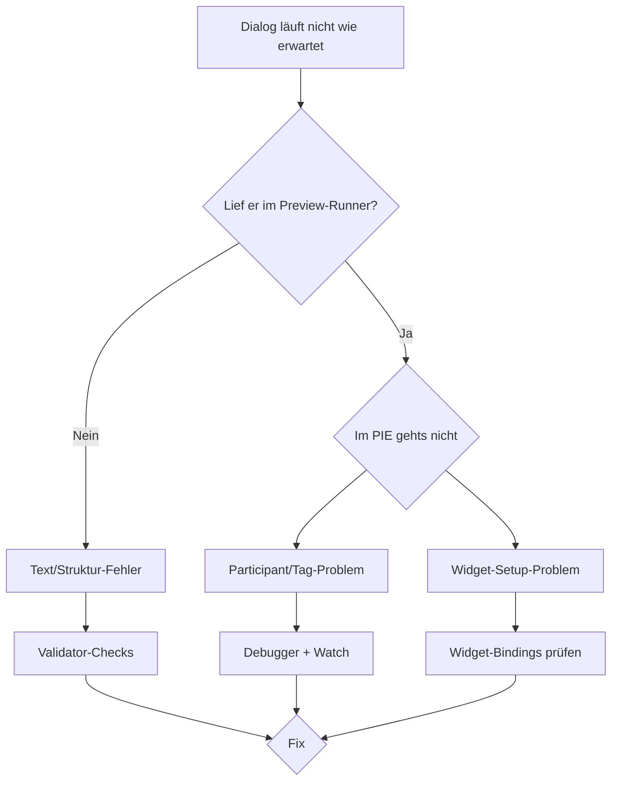

# Troubleshooting

Wenn etwas nicht funktioniert, findest du hier Antworten.

## Struktur

* [Häufige Probleme](common-issues.md) – die wichtigsten *„Warum geht mein Dialog nicht?"*-Antworten.
* [Debug-Tipps](debugging-tips.md) – Checkliste + Werkzeuge für systematisches Debugging.
* [Bekannte Issues](known-issues.md) – Stand der offenen Bugs und Roadmap-Items.

## Empfohlener Debug-Flow

## Schnelle Diagnose-Fragen

* **Startet der Dialog gar nicht?** → [common-issues.md#dialog-start](common-issues.md)
* **Kein Widget erscheint?** → [common-issues.md#widget](common-issues.md)
* **Choices fehlen?** → [common-issues.md#choices](common-issues.md)
* **Audio läuft nicht?** → [common-issues.md#audio](common-issues.md)
* **Variable wird nicht übernommen?** → [common-issues.md#variables](common-issues.md)
* **Crash oder Log-Error?** → [debugging-tips.md](debugging-tips.md)
