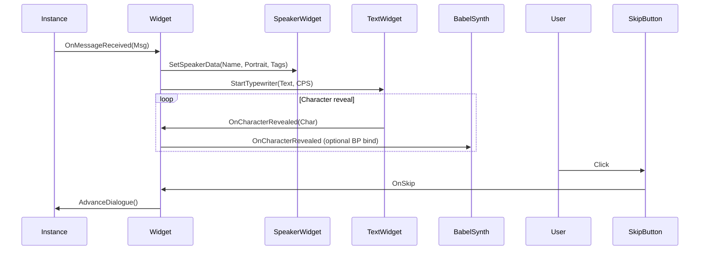

# UI-System

MayDialogue liefert **zwei vollständige UI-Implementierungen**:

1. **Slate-Debug-Widget** (`SMayDialogueWidget`) – minimalistisch, funktioniert ohne jede Konfiguration. Perfekt für Prototyping und Debug-Builds.
2. **UMG-Komponenten-Architektur** (`UMayDialogueWidget`) – komponenten-basiert, in mehreren Blueprint-Widgets zerlegt, production-grade.

## Philosophie

Designer sollen **kein Blueprint-Skript** schreiben, um einen Dialog ins UI zu bringen. Sie sollen **Bausteine austauschen**.

## Kapitel-Übersicht

* [Slate-Debug-Widget](slate-debug-widget.md) – das Default-Fallback.
* [UMG-Architektur](umg-architecture.md) – Übersicht über die fünf Widget-Klassen.
* [Dialog Frame](dialog-frame.md) – der Container.
* [Speaker Widget](speaker-widget.md) – Name + Portrait.
* [Text Widget](text-widget.md) – Typewriter-Engine.
* [Choice List & Choice Button](choice-list.md) – Antwort-Buttons.
* [Skip Button](skip-button.md) – Advance-Input.
* [Typewriter-Engine](typewriter.md) – wie Text animiert wird.
* [Rich-Text-Tags](rich-text-tags.md) – Inline-Formatierung.
* [Themes & Starterkits](themes.md) – vorgefertigte Designs.

## Zwei Modi des Top-Level-Widgets

`UMayDialogueWidget` kann in zwei Modi laufen:

* **Component-Based** (empfohlen). Alle Unter-Widgets sind per `BindWidget` verknüpft. Das Parent-Widget koordiniert nur Event-Dispatch.
* **Monolithic Legacy**. Wenn keine Sub-Widgets gebunden sind, rendert das Parent-Widget selbst Typewriter + Choices. Wird aus Kompatibilitätsgründen mitgeführt.

Für alle neuen Projekte: **Component-Based**.

## Daten-Fluss

