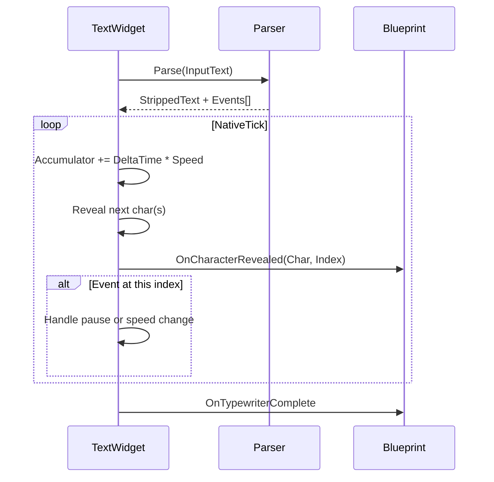

# Typewriter-Engine

Der Typewriter-Effekt läuft in `UMayDialogueWidget_Text::NativeTick`. Dieses Kapitel erklärt die Parser-Grammatik und das Event-Modell.

## Aktivierung

Globaler Schalter in den [Project Settings](../getting-started/project-settings.md):

```
bEnableTypewriterEffect = true
TypewriterCharsPerSecond = 30.0
```

Wenn `false`: Text erscheint sofort komplett.

## Parser-Grammatik

Der `FMayDialogueTypewriterParser::Parse()` macht **einen Pass** durch den Eingabe-Text und erkennt zwei **Control-Tags**:

| Tag | Wirkung |
| --- | --- |
| `<pause=X>` | Pausiert den Typewriter für X Sekunden. |
| `<speed=X>` | Multipliziert die Geschwindigkeit ab dieser Position. `<speed=1.0>` resettet. |

**Beide Tags werden im Parser konsumiert** – sie erscheinen nicht im angezeigten Text.

Visuelle Tags (`<shake>`, `<wave>`, `<color>`, `<b>`) bleiben **unangetastet** – sie werden später vom Rich-Text-Decorator-System verarbeitet.

## Parser-Ausgabe

```cpp
struct FTypewriterParseResult
{
    FText StrippedText;              // Text ohne Control-Tags, aber mit visuellen Tags
    TArray<FTypewriterEvent> Events; // Sortiert nach Char-Index
};

struct FTypewriterEvent
{
    int32 CharIndex;     // im StrippedText
    float PauseDuration; // wenn > 0
    float SpeedMultiplier; // wenn > 0
};
```

Der Tick konsumiert Events in Reihenfolge.

## Event-Flow



## CharactersPerSecond vs. SpeedMultiplier

* `CharactersPerSecond` ist die **Grundgeschwindigkeit** pro Widget-Call.
* `<speed=X>` multipliziert die **Grundgeschwindigkeit** temporär.
* `CurrentSpeedMultiplier` wird beim Zeilen-Ende automatisch zurückgesetzt.

Beispiel: `CPS = 30`, aktives `<speed=2.0>` → 60 Zeichen/Sekunde.

## Pause-Event

Beim Erreichen eines Pause-Events:

1. Tick-Akkumulator wird gestoppt.
2. Parallel-Timer läuft für die Pause-Dauer.
3. Nach Ablauf: Akkumulator läuft wieder.

## Bekannte Einschränkungen

* **Keine Verschachtelung**. `<pause=<speed=2>1>` ist undefiniert.
* **Kein Escape**. Literal-`<pause=` im Text wird als Tag interpretiert.
* **Keine Validierung**. `<pause=abc>` wird zu 0 Sekunden.

## Debug-Tipps

* **Text läuft zu schnell / zu langsam**: Global `TypewriterCharsPerSecond` prüfen.
* **Tag wird angezeigt statt konsumiert**: Tag-Schreibweise falsch – kein Leerzeichen in `<pause=0.5>`, kein fehlendes `=`.
* **Pause wirkt nicht**: Char-Index-Zählung basiert auf *strippedText*, nicht dem Original. Das ist gewollt und transparent, solange der Parser funktioniert.

## Integration mit Babel

Das Text-Widget feuert `OnCharacterRevealed`. Binde es im Blueprint an `BabelSynth->OnCharacterRevealed`, damit jedes Zeichen akustisch begleitet wird.

Siehe [Audio → Babel-System](../audio/babel-system.md).

## Verhältnis zu Rich-Text-Tags

| Tag-Typ | Verarbeitet von | Erscheint im Text? |
| --- | --- | --- |
| `<pause=X>` | Typewriter-Parser | Nein (konsumiert) |
| `<speed=X>` | Typewriter-Parser | Nein (konsumiert) |
| `<shake>...</shake>` | RichText-Decorator | Ja (visuell) |
| `<wave>...</wave>` | RichText-Decorator | Ja (visuell) |
| `<color=...>...</color>` | RichText-Decorator | Ja (visuell) |
| `<b>...</b>` | RichText-Decorator | Ja (visuell) |

Weiter: [Rich-Text-Tags](rich-text-tags.md).
