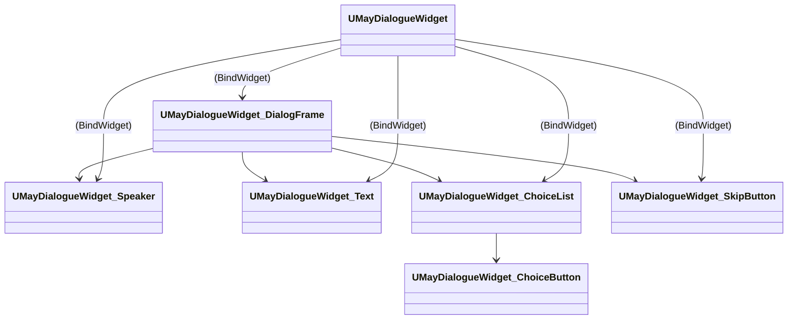

# UMG-Architektur

Die UMG-Schicht ist **komponenten-basiert**. Statt einem monolithischen „Dialog-Widget" liefert MayDialogue ein Set aus fünf Widget-Klassen, die sich zusammen-komposieren.

## Die fünf Widget-Klassen



| Klasse | Aufgabe |
| --- | --- |
| [`UMayDialogueWidget`](#top-level) | Top-Level-Container, Event-Dispatcher. |
| [`UMayDialogueWidget_DialogFrame`](dialog-frame.md) | Container für die Unter-Widgets, Open/Close-Animationen. |
| [`UMayDialogueWidget_Speaker`](speaker-widget.md) | Name + Portrait + Emotion-Tags. |
| [`UMayDialogueWidget_Text`](text-widget.md) | Typewriter-Text. |
| [`UMayDialogueWidget_ChoiceList`](choice-list.md) | Container für Choice-Buttons. |
| [`UMayDialogueWidget_ChoiceButton`](choice-list.md#choicebutton) | Einzelner Antwort-Button. |
| [`UMayDialogueWidget_SkipButton`](skip-button.md) | Advance-Input-UI. |

## Top-Level

`UMayDialogueWidget` hat **optionale BindWidget-Slots**:

```cpp
UPROPERTY(meta=(BindWidgetOptional))
UMayDialogueWidget_DialogFrame* DialogFrameWidget;

UPROPERTY(meta=(BindWidgetOptional))
UMayDialogueWidget_Speaker* SpeakerWidget;

UPROPERTY(meta=(BindWidgetOptional))
UMayDialogueWidget_Text* TextWidget;

UPROPERTY(meta=(BindWidgetOptional))
UMayDialogueWidget_ChoiceList* ChoiceListWidget;

UPROPERTY(meta=(BindWidgetOptional))
UMayDialogueWidget_SkipButton* SkipButtonWidget;
```

Wenn du ein Blueprint-Widget von `UMayDialogueWidget` ableitest und diese Slots durch gleichnamige Child-Widgets füllst (einfach das Widget im Designer platzieren und benennen), binden sie sich automatisch.

## Zwei Konfigurations-Pfade

### Pfad A – Ein zusammengesetztes Widget

Du baust ein einziges Blueprint-Widget `WBP_MayDialogue` auf Basis von `UMayDialogueWidget`:

```
WBP_MayDialogue
├── Canvas Panel
│   ├── SpeakerWidget        (WBP_Speaker – von UMayDialogueWidget_Speaker)
│   ├── TextWidget           (WBP_Text – von UMayDialogueWidget_Text)
│   ├── ChoiceListWidget     (WBP_ChoiceList – von UMayDialogueWidget_ChoiceList)
│   └── SkipButtonWidget     (WBP_SkipButton – von UMayDialogueWidget_SkipButton)
```

Setze dann:

```ini
[Project Settings → MayDialogue]
DefaultDialogueWidgetClass = /Game/UI/WBP_MayDialogue.WBP_MayDialogue_C
```

### Pfad B – Defaults aus Settings

Du definierst nur `DefaultSpeakerWidgetClass`, `DefaultTextWidgetClass` etc. in den Projekt-Settings. Das System kombiniert sie zur Laufzeit.

Pfad A ist übersichtlicher und hat weniger Indirektion. Pfad B ist flexibler, wenn du verschiedene Widget-Kombinationen pro Szenen-Typ willst.

## Delegates

Das Top-Level-Widget bindet sich automatisch an die aktive Instance oder an den lokalen Participant (wichtig für Multiplayer). Du musst im Blueprint nichts verdrahten.

## Subscriptions im Widget

* `InstanceBound`: Wenn du nur Singleplayer hast, bind an Instance-Delegates.
* `ParticipantBound`: Wenn Multiplayer, bind an Client-RPC-Events am lokalen Participant.

Beide Pfade liefern dieselben Events an die Child-Widgets.

## Typische Fehler

* **SkipButton reagiert nicht** – prüfe, ob `SkipClickButton` innerhalb des SkipButton-Widgets korrekt benannt ist.
* **Speaker-Portrait lädt nicht** – `Portrait` in `FMayDialogueSpeaker` ist `TSoftObjectPtr`, Load ist async. Im Widget warten auf `OnSpeakerChanged`.
* **Typewriter ruft Babel nicht auf** – im Component-Pfad nicht automatisch verdrahtet; binde `TextWidget->OnCharacterRevealed` manuell in deinem Blueprint.

Weiter: [Dialog Frame](dialog-frame.md).
